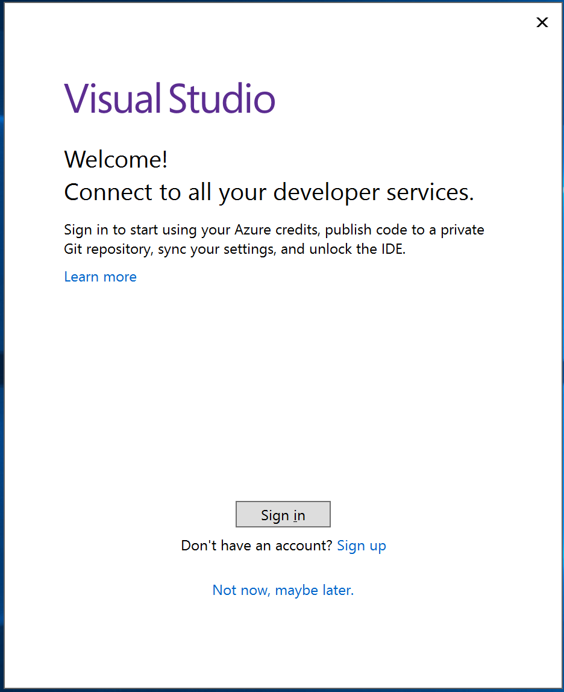
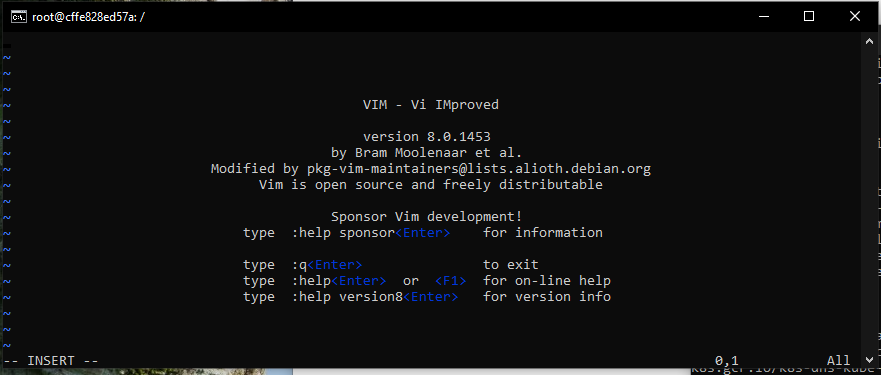

## 0 to 60: Windows Containers

## Hands-on lab

##

January 2019

Information in this document, including URL and other Internet Web site references, is subject to change without notice. Unless otherwise noted, the example companies, organizations, products, domain names, e-mail addresses, logos, people, places, and events depicted herein are fictitious, and no association with any real company, organization, product, domain name, e-mail address, logo, person, place or event is intended or should be inferred. Complying with all applicable copyright laws is the responsibility of the user. Without limiting the rights under copyright, no part of this document may be reproduced, stored in or introduced into a retrieval system, or transmitted in any form or by any means (electronic, mechanical, photocopying, recording, or otherwise), or for any purpose, without the express written permission of Microsoft Corporation.

Microsoft may have patents, patent applications, trademarks, copyrights, or other intellectual property rights covering subject matter in this document. Except as expressly provided in any written license agreement from Microsoft, the furnishing of this document does not give you any license to these patents, trademarks, copyrights, or other intellectual property.

The names of manufacturers, products, or URLs are provided for informational purposes only and Microsoft makes no representations and warranties, either expressed, implied, or statutory, regarding these manufacturers or the use of the products with any Microsoft technologies. The inclusion of a manufacturer or product does not imply endorsement of Microsoft of the manufacturer or product. Links may be provided to third party sites. Such sites are not under the control of Microsoft and Microsoft is not responsible for the contents of any linked site or any link contained in a linked site, or any changes or updates to such sites. Microsoft is not responsible for webcasting or any other form of transmission received from any linked site. Microsoft is providing these links to you only as a convenience, and the inclusion of any link does not imply endorsement of Microsoft of the site or the products contained therein.

© 2019 Microsoft Corporation. All rights reserved.

Microsoft and the trademarks listed at [https://www.microsoft.com/en-us/legal/intellectualproperty/Trademarks/Usage/General.aspx](https://www.microsoft.com/en-us/legal/intellectualproperty/Trademarks/Usage/General.aspx) are trademarks of the Microsoft group of companies. All other trademarks are property of their respective owners.

# Contents

Windows Containers hands-on lab        5

Abstract and learning objectives        5

Overview        5

Requirements        6

Before the hands-on lab        7

Help references        7

Task 1: Set up the environment        7

Task 2: Validate you can connect to the Development Environment        12

Task 3: Verify Docker for Desktop is Installed        13

Task 4: Launch Visual Studio        14

Exercise 1: Introduction to Docker        18

Task 1: Run Command        18

Task 2: PS Command        18

Task 3: Stop Command        20

Task 4: Exec Command        20

Task 5: Environment Variables        21

Task 5: Images Command        22

Task 6: RM Command        23

Task 7: RMI Command        23

Task 8: System Command        23

Task 9: Dockerfile        24

Exercise 2: Containerize Legacy Solution        26

Prerequisites        27

Help references        27

Task 1: Add Docker Support into Visual Studio        28

Task 2: Add Docker Support into Visual Studio Code        28

Task 3: Add Azure CLI        28

Task 4: Create a Dockerfile &amp; Install Base Container Image        29

Task 5: Create Docker Images        29

Task 6: Run a containerized application        29

Task 7: Debug Solution in Docker Locally        29

Exercise 3: Deploy Solution to Azure        30

Task 1: Create Azure Container Registry        30

Task 2: Push Image to Azure Container Registry        30

Task 3: Deploy to Azure Container Instance        31

Task 4: Deploy to Azure Web App        31

Exercise 4: Setting up a CI/CD Pipeline for Containers        31

Prerequisites        31

Help references        31

Task 1: DevOps Project        32

Task 2: Azure DevOps Pipeline        32

After the hands-on workshop        33

Task 1: Delete the Resource Group in which you placed your Azure resources.        33

#
# Windows Containers

#

# hands-on lab

## Abstract and learning objectives

Build a PoC to migrate and existing ASP.NET web application into a multi-tenant web application leveraging Azure.

Attendance will be able to:

- Create &amp; run a Docker Application
- Deploy to Azure App Services &amp; Azure Container Instances

## Overview

TBD

## Requirements

1. Microsoft Azure subscription (non-Microsoft subscription)
2. **Global Administrator role** for Azure AD within your subscription
3. Local machine with Remote Desktop installed

## Before the hands-on lab

Duration: 30 minutes

In this exercise, you will set up your environment for use for the rest of the exercises. This will involve downloading the assets from the repository and deploying them to Azure. We will use your workstation to set up the environment and connect to Virtual Machines via Remote Desktop.

#### Help references

| Azure Templates | [https://azure.microsoft.com/en-us/resources/templates/](https://azure.microsoft.com/en-us/resources/templates/)  |
| --- | --- |
| PowerShell Gallery | [http://www.powershellgallery.com/](http://www.powershellgallery.com/)  |
| Containers on Windows | https://aka.ms/containers |

#### Task 1: Set up the environment

###### Tasks to complete

1. Deployed the environment template to Azure

###### Exit criteria

- Initiate the environment deploy from the repository

Open your browser to [https://github.com/danielshue/containersworkshop](https://github.com/danielshue/containersworkshop)

Click on the &quot;Deploy to Azure&quot; button

This will take you to the Azure portal.  If prompted, log into your subscription.

The portal will read the template and prompt you for parameters;

- Pick your subscription
- Create a new resource group (e.g. ContainerWorksop)
- Enter the Admin User Name and Admin User Password for your VMs or leave the default settings.

**Default Settings**

Admin User Name: sysadmin
Admin User Password: Password$123

Note: if you don&#39;t have a Visual Studio Enterprise License, please select the community edition for the Dev Workstation OS Version.

Note: Do not modify the values for \_artifacts Location.

When done, check the &quot;I agree to terms…&quot;, check pin to Dashboard, and click the **Purchase** button

After you click **Purchase** you will be taken to the dashboard and you will see a &quot;Deploying Template&quot; Tile.

Clicking on the tile will show you deployment information and status.  This shows all the parameters that were used as part of your deployment, and at the bottom of the blade, will show you the deployment status:

Refreshing the blade will update the deployment status.  The deployment will first create the vNet, then the web and SQL servers in parallel, and finally create the developer workstation and deploy the app.  The entire process should take between 18 and 25 minutes.

You can navigate away from this page and review the resource group.  In the top right of the resource group, you will also see deployment information.

Clicking this link will take you to the list of completed and active deployments

Once the deployment is complete, review the vmweb01 configuration to find the public URL.  Copy the URL, open a browser, and paste and go to verify that everything worked correctly.

#### Task 2: Validate you can connect to the Development Environment

Now that the environment is set up, we need to make sure we can connect to the development environment where we will be doing the exercises for this workshop.

###### Tasks to complete

1. Verify connectivity to the development virtual machine
2. Sign in to Visual Studio

###### Exit criteria

- If needed, install Visual Studio Community in development virtual machine

Remote into the vmdev01 using the User Name and Password used when creating the environment.

Note:

Default Admin: sysadmin

Default Password: Password$123

#### Task 3: Verify Docker for Desktop is Installed

Now that the development environment set up, we need to install Docker for Windows in order to complete the exercises in this workshop.

###### Tasks to complete

1. If necessary, create a Docker account.
2. Download, install, and configure Docker onto Developer Machine (vmdev01)

###### Exit criteria

- If needed, install Visual Studio Community in development virtual machine

When you first logged into the virtual machine, a script got kicked off that installs some additional software, including Docker. Do not close this window and let this script finish installing.

Once the installation has completed, the Virtual Machine will reboot. After about a minute, login back into the Virtual Machine.  You will get a dialog with indicating that Hyper-V needs to be configured and will reboot one more time. Click on OK on the dialog and login back into the Virtual Machine in a few moments.

#### Task 4: Launch Visual Studio

- Launch and Configure Visual Studio

Note:

If you don&#39;t have Visual Studio Enterprise, you should have deployed the community edition.

Click **&quot;Sign In&quot;**.  Type your Microsoft Account or Corporate Account, whichever account name you use for your Visual Studio Subscription (MSDN).

- Open the Solution which is located at C:\Source\ folder.

After rebooting and logging back in, in a moment after the services have initialized, you&#39;ll see a window that opens that indicates that Docker is Running.

Start a command prompt and type in the following:

docker run hello-world

If Docker is successfully running, you&#39;ll get a message saying everything is working:

## Exercise 1: Introduction to Docker

To interact with containers on your system, there are several docker commands that are available.

#### Task 1: Run Command

The docker run command is used to run a container. If the image doesn&#39;t exist locally, Docker will go out to the DockerHub and _pull_ the image the very first time. In this case, docker will run the Ubuntu image.

docker run ubuntu

_To run ubuntu command, Docker must be running Linux containers._

#### Task 2: PS Command

Once a container is running, to see a list of running containers, use the PS command.

docker ps

This will show the _Container ID, Image, Command, Created, Status, Ports, and Names of the running processes. To see a list of all of the running containers, present_

docker ps -a

In our case, you can see the _ubuntu_ image ran, executed the _&quot;/bin/bash&quot;_ command and exited 0 a few minutes ago. That&#39;s because the image was not set up to execute anything and is typically used for building other images. If we want to interact with the running container and this particular image, we can have the container run a shell, such as a bash.

docker run-i -t ubuntu /bin/bash

This Ubuntu image only has the basic software installed. To install additional packages, update from the repository. Take special note of the hostname as when we **stop** the current container and re-run or run another instance of the container, the hostname will change.

apt-get update -y

apt-get install vim

Now that VIM is installed, execute VIM from the shell to see it load and use the &quot;:q&quot; to quit. Now **exit** the shell.

#### Task 3: Stop Command

To stop a running container, issue a stop command to the container. Docker needs to have either the name of the container or the ID. To get a list of the container name or ID, you can view the running containers by using the **docker ps** command above.

docker stop 60c65e77efb0A

After stopping the container, run the Bash shell again in order load VIM.  You should receive an error from bash saying the command is not found. Note the from the previous step when the command is ran that the new hostname (container instance) is used.

docker run -i -t ubuntu /bin/bash

#### Task 4: Exec Command

If a container is already running, you may want to execute a command inside the running container. The exec command will run in the default directory of the container and return. To start a process running in the background, we&#39;ll create and use a web server called nginx container called &quot;docker-nginx&quot; and map the local port 9001 to the server&#39;s port 80. Since we&#39;ll want to interact with the running container, we&#39;ll want to run the container detached by passing in the &quot;-d&quot; parameter and we&#39;ll have docker automatically remove the container when the webserver exists by using the &quot;--rm&quot; parameter.

docker run -dit --rm --name nginx -p 9001:80 nginx

When the command runs, use the web browser to navigate and verify the process is running by going to [http://localhost:9001/](http://localhost:9001/).

Perhaps you want to see the output of the /etc directory in the running container, you can simply issue the exec command against the running container.

docker exec nginx ls

If you want to edit a file or interact with the running container, you execute a command using the &quot;-it&quot; parameter and run a shell. This attaches to the running container and redirects the tty output to the console.

docker exec -it nginx /bin/bash

#### Task 5: Environment Variables

There may be times when you need to set environment variables when running your application. These values can be set when

Start the container and pass in the environment variable setting by using the &quot;-e&quot; in the name=value pair format. In this case, we&#39;ll set the name of the environment variable to &quot;API\_HOST&quot; and the value to it [http://localhost:9000](http://localhost:9000).

docker run -dit -e API\_HOST=http://localhost:9000 --name nginx -p 9001:80 nginx

When Docker returns, run go into interactive mode so we can check to see if the environment variables go set correctly by running the env command from bash

docker exec -it nginx /bin/bash

 env

#### Task 5: Images Command

All the images we have installed locally in our local repository can be listed be running the **images list** command

docker image list

The output shows the Repository, Tag, Image ID, Created, and Size.  If you notice the Repository, the it contains the &quot;repository name/image&quot; naming convention. When referring to an image, if no &quot;repository name&quot; is used, the image will refer to DockerHub. Another convention is Notice several images also contain a &quot;tag&quot; representing a version number. If no tag is represented, then &quot;latest&quot; will be used.

REPOSITORY / IMAGE NAME : TAG

Notice the size of the Ubuntu image that is pulled down is only 86 MB. This is a small image size, especially when compared to Microsoft Nano Server which is over 4 GB.

#### Task 6: RM Command

To remove a container, use the RM command and then the name of the ID or the name of the container. Before a container can be removed, it must be stopped and cannot be running. Use the &quot;ps --all&quot; command to see a list of all containers that have ran.

docker rm cranky\_glick

If there are to many containers listed and you&#39;re not sure to which container has stopped, **filter** the return process list based off the status exited.

docker ps -a -f status=exited

From the image list, notice the NAMES of the containers. Since we run these containers and didn&#39;t pass in the &#39;--name&#39; flag, Docker autogenerated these names. If you want to refer to your Containers by names, its recommended you pass in the name when creating.

#### Task 7: RMI Command

If we are no longer using an image we pulled down from a repository, we can remove it from our local repository so It no longer consumes storage space. The RMI command can remove an image from the repository provided it the base image no longer is being used by a running container.

docker rmi ubuntu

#### Task 8: System Command

If you&#39;re a done with docker and want to clean up any resources such as images (used and unused), containers, volumes, and networks, the prune command will purge everything.

docker system prune -a

…

#### Task 9: Dockerfile

A Dockerfile is used to instruct docker how to create an image that is stored in a registry. Here we&#39;ll create our first Docker image file using a .NET ASP.Net Core MVC application.

Reference:

[https://docs.microsoft.com/en-us/dotnet/core/docker/docker-basics-dotnet-core?view=aspnetcore-2.2](https://docs.microsoft.com/en-us/dotnet/core/docker/docker-basics-dotnet-core?view=aspnetcore-2.2)

mkdir c:\aspnetapp

cd c:\aspnetapp

dotnet new mvc

Now that we have the basic application made, lets go ahead and create the Dockerfile that goes into the base folder.

Dockerfile:

FROM microsoft/dotnet:sdk AS build-env

WORKDIR /app

# Copy csproj and restore as distinct layers

COPY \*.csproj ./

RUN dotnet restore

# Copy everything else and build

COPY . ./

RUN dotnet publish -c Release -o out

# Build runtime image

FROM microsoft/dotnet:aspnetcore-runtime

WORKDIR /app

COPY --from=build-env /app/out .

ENTRYPOINT [&quot;dotnet&quot;, &quot;aspnetapp.dll&quot;]

After saving the file, we&#39;ll use Docker to build the image.

docker build -t aspnetapp .

Now that our image has been created, we&#39;ll want to test our new application.

docker run -d -p 8080:80 --name myapp aspnetapp

Browse to [http://localhost:8080](http://localhost:8080) to view the sample project.

## Exercise 2: Containerize Legacy Solution

Duration: 120 minutes

Parts Unlimited is in the auto part business.  They typically sell via a brick and mortar store but have invested in a small e-commerce presence to augment those stores.  They have seen an uptick in use from customers and have been getting some complaints about the speed of the site and requests for additional features and functionality.

Parts Unlimited would like to expand and improve their ecommerce presence, experiment with new features and business strategies to help grow the business.  However, they are not interested in sinking large sums of money into hardware and the management of that hardware.  They want to quickly spin something up to see how it works, scale it if it does, and deprovision it if it doesn&#39;t.  They also want more flexibility in how they scale their solutions given the seasonal nature of what they do.

Currently, Parts Unlimited consists of an ASP.NET 4.5.1 website running on Microsoft Windows 2016 and SQL database running on Microsoft SQL 2016.  They want to improve their deployment process by moving their solution into a Windows Container.

- Deployment Slots
- Testing in Production
- Scale up / Scale out
- Authentication Support for Azure AD, Facebook, twitter, etc.
- Diagnostic Tools
- Security Center
- No OS to manage or patch
- Etc.

These features setup Parts Unlimited for future enhancement and scale without having to plan for and manage infrastructure.

#### Prerequisites

To complete this task, you should have provisioned the Parts Unlimited IaaS environment.  This is used to simulate the on premises environment and provide a developer workstation for you to work in complete with source control.  The website should be running in your Azure Subscription to complete this section.

#### Help references

| Windows Containers on Windows 10 | https://docs.microsoft.com/en-us/virtualization/windowscontainers/quick-start/quick-start-windows-10 |
| --- | --- |
| App Service Overview | [https://docs.microsoft.com/en-us/azure/app-service/app-service-web-overview](https://docs.microsoft.com/en-us/azure/app-service/app-service-web-overview)  |
| Migration to Azure | [https://www.migratetoazure.net/](https://www.migratetoazure.net/)  |
| Azure SQL Database | [https://docs.microsoft.com/en-us/azure/sql-database/](https://docs.microsoft.com/en-us/azure/sql-database/)  |

###### Switching to Windows Containers

After installation Docker for Windows defaults to running Linux containers. Switch to Windows containers using either the Docker tray-menu or by running the following command in a PowerShell prompt:

Power Shell

$Env:ProgramFiles\Docker\Docker\DockerCli.exe -SwitchDaemon .

#### Task 1: Add Docker Support into Visual Studio

In this exercise, you will install Docker into your machine

- Add

###### Tasks to complete

1. d

###### Exit criteria

- Note the URLs of the provisioned web for future reference
- Save the new database connection string for later

From your freshly created environment.

Introduction to Docker Commands

#### Task 2: Add Docker Support into Visual Studio Code

In this exercise, you will install Docker into your machine

- Add

###### Tasks to complete

1. d

###### Exit criteria

- Note the URLs of the provisioned web for future reference
- Save the new database connection string for later

From your freshly created environment.

Introduction to Docker Commands

#### Task 3: Add Azure CLI

In this exercise, you will install Azure CLI into your machine

- Add

###### Tasks to complete

1. Install CLI

###### Exit criteria

- TBD

In later exercises, you will need the Azure CLI 2.0 to connect to your Kubernetes cluster and run commands from your local machine. A complete list of instructions for supported platforms is available on this page:

https://docs.microsoft.com/en-us/cli/azure/install-azure-cli?view=azure-cli-latest

#### Task 4: Create a Dockerfile &amp; Install Base Container Image

In this exercise, you will download the base container image.

- Add

###### Tasks to complete

1. Install container onto local repository

###### Exit criteria

- Base Image containers will be installed onto your local repository

Windows containers are built from base images. The following command will pull the Nano Server base image, the latest Windows Server Nano Server, Core, and the 2016 version.

docker pull microsoft/nanoserver

docker pull microsoft/windowsservercore:latest

docker pull microsoft/windowsservercore:ltsc2016

#### Task 5: Create Docker Images

TBD

- TBD

###### Tasks to complete

1. TBD

###### Exit criteria

- TBD

TBD

#### Task 6: Run a containerized application

TBD

- TBD

###### Tasks to complete

1. TBD

###### Exit criteria

- TBD

TBD

#### Task 7: Debug Solution in Docker Locally

TBD

- TBD

###### Tasks to complete

1. Update DockerFile with Supported Windows Version
2. Docker Build
3. Docker Image
4. Docker PS
5. Docker Run
6. Docker Stop
7. Docker Remove
8. Docker Tag (Two Properties: DateTime Stamp + Feature)
9. Docker Attach (Drop into command prompt of container)
10. Docker Exec (Output) (e.g. docker exec [containerid] ipconfig)

###### Exit criteria

- TBD

TBD

## Exercise 3: Deploy Solution to Azure

#### Task 1: Create Azure Container Registry

TBD

- TBD

###### Tasks to complete

1. Create Azure Container Registry from CLI
2. Create Azure Container Registry from Portal
3. Enable Admin User to the Registry
4. Obtain Keys using CLI

###### Exit criteria

- TBD

TBD

#### Task 2: Push Image to Azure Container Registry

TBD

- TBD

###### Tasks to complete

1. Docker Build
2. Docker Tag with ACR URL
3. Docker Push

###### Exit criteria

- TBD

TBD

#### Task 3: Deploy to Azure Container Instance

TBD

- TBD

###### Tasks to complete

1. TBD

###### Exit criteria

- TBD

TBD

#### Task 4: Deploy to Azure Web App

TBD

- TBD

###### Tasks to complete

1. TBD

###### Exit criteria

- TBD

TBD

## Exercise 4: Setting up a CI/CD Pipeline for Containers

Duration: 120 minutes

TBD

#### Prerequisites

To complete this task, you should have provisioned the Parts Unlimited IaaS environment.  This is used to simulate the on premises environment and provide a developer workstation for you to work in complete with source control.  The website should be running in your Azure Subscription to complete this section.

#### Help references

| App Service Overview | [https://docs.microsoft.com/en-us/azure/app-service/app-service-web-overview](https://docs.microsoft.com/en-us/azure/app-service/app-service-web-overview)  |
| --- | --- |

#### Task 1: DevOps Project

TBD

- TBD

###### Tasks to complete

1. TBD

###### Exit criteria

- TBD

TBD

#### Task 2: Azure DevOps Pipeline

TBD

- TBD

###### Tasks to complete

1. TBD

###### Exit criteria

- TBD

TBD

#### Task 3: Monitoring Workload

TBD

- TBD

###### Tasks to complete

1. TBD

###### Exit criteria

- TBD

TBD

## After the hands-on workshop

Duration: 10 minutes

In this exercise, attendees will deprovision any Azure resources that were created in support of the lab.

#### Task 1: Delete the Resource Group in which you placed your Azure resources.

1. From the Portal, navigate to the blade of your Resource Group and click Delete in the command bar at the top
2. Confirm the deletion by re-typing the resource group name and clicking Delete

You should follow all steps provided _after_ attending the hands-on lab.