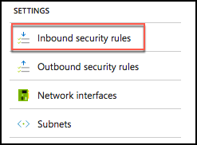
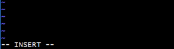
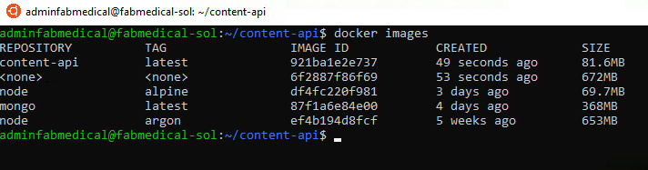
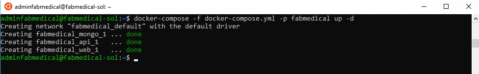
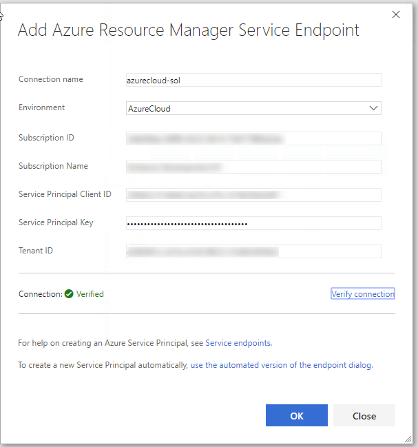
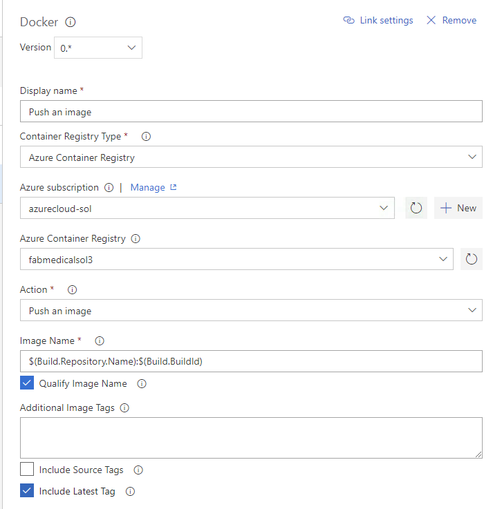

<div class="MCWHeader1">
Containers and DevOps - Developer edition
</div>

<div class="MCWHeader2">
Hands-on lab step-by-step - Exercise 1 
</div>

<div class="MCWHeader3">
April 2019
</div>

Information in this document, including URL and other Internet Web site references, is subject to change without notice. Unless otherwise noted, the example companies, organizations, products, domain names, e-mail addresses, logos, people, places, and events depicted herein are fictitious, and no association with any real company, organization, product, domain name, e-mail address, logo, person, place or event is intended or should be inferred. Complying with all applicable copyright laws is the responsibility of the user. Without limiting the rights under copyright, no part of this document may be reproduced, stored in or introduced into a retrieval system, or transmitted in any form or by any means (electronic, mechanical, photocopying, recording, or otherwise), or for any purpose, without the express written permission of Microsoft Corporation.

Microsoft may have patents, patent applications, trademarks, copyrights, or other intellectual property rights covering subject matter in this document. Except as expressly provided in any written license agreement from Microsoft, the furnishing of this document does not give you any license to these patents, trademarks, copyrights, or other intellectual property.

The names of manufacturers, products, or URLs are provided for informational purposes only and Microsoft makes no representations and warranties, either expressed, implied, or statutory, regarding these manufacturers or the use of the products with any Microsoft technologies. The inclusion of a manufacturer or product does not imply endorsement of Microsoft of the manufacturer or product. Links may be provided to third party sites. Such sites are not under the control of Microsoft and Microsoft is not responsible for the contents of any linked site or any link contained in a linked site, or any changes or updates to such sites. Microsoft is not responsible for webcasting or any other form of transmission received from any linked site. Microsoft is providing these links to you only as a convenience, and the inclusion of any link does not imply endorsement of Microsoft of the site or the products contained therein.

© 2019 Microsoft Corporation. All rights reserved.

Microsoft and the trademarks listed at https://www.microsoft.com/en-us/legal/intellectualproperty/Trademarks/Usage/General.aspx are trademarks of the Microsoft group of companies. All other trademarks are property of their respective owners.

**Contents**

<!-- TOC -->
- [Containers and DevOps - Developer edition hands-on lab step-by-step]
  - [Exercise 1: Create and run a Docker application](#exercise-1-create-and-run-a-docker-application)
    - [Task 1: Test the application](#task-1-test-the-application)
    - [Task 2: Enable browsing to the web application](#task-2-enable-browsing-to-the-web-application)
    - [Task 3: Create a Dockerfile](#task-3-create-a-dockerfile)
    - [Task 4: Create Docker images](#task-4-create-docker-images)
    - [Task 5: Run a containerized application](#task-5-run-a-containerized-application)
    - [Task 6: Setup environment variables](#task-6-setup-environment-variables)
    - [Task 7: Push images to Azure Container Registry](#task-7-push-images-to-azure-container-registry)

<!-- /TOC -->

# Containers and DevOps - Developer edition hands-on lab step-by-step


## Exercise 1: Create and run a Docker application

**Duration**: 40 minutes

In this exercise, you will take the starter files and run the node.js application as a Docker application. You will create a Dockerfile, build Docker images, and run containers to execute the application.

> **Note**: Complete these tasks from the WSL window with the build agent session.

### Task 1: Test the application

The purpose of this task is to make sure you can run the application successfully before applying changes to run it as a Docker application.

1. From the WSL window, connect to your build agent if you are not already connected.

2. Type the following command to create a Docker network named "fabmedical":

    ```bash
    docker network create fabmedical
    ```

3. Run an instance of mongodb to use for local testing.

    ```bash
    docker run --name mongo --net fabmedical -p 27017:27017 -d mongo
    ```

4. Confirm that the mongo container is running and ready.

    ```bash
    docker container list
    docker logs mongo
    ```

    

5. Connect to the mongo instance using the mongo shell and test some basic commands:

    ```bash
    mongo
    ```

    ```text
    show dbs
    quit()
    ```

    

6. To initialize the local database with test content, first navigate to the content-init directory and run npm install.

    ```bash
    cd content-init
    npm install
    ```

7. Initialize the database.

    ```bash
    nodejs server.js
    ```

    

8. Confirm that the database now contains test data.

    ```bash
    mongo
    ```

    ```text
    show dbs
    use contentdb
    show collections
    db.speakers.find()
    db.sessions.find()
    quit()
    ```

    This should produce output similar to the following:

    

9. Now navigate to the content-api directory and run npm install.

    ```bash
    cd ../content-api
    npm install
    ```

10. Start the API as a background process.

    ```bash
    nodejs ./server.js &
    ```

    

11. Press ENTER again to get to a command prompt for the next step.

12. Test the API using curl. You will request the speaker's content, and this will return a JSON result.

    ```bash
    curl http://localhost:3001/speakers
    ```

13. Navigate to the web application directory, run npm install and bower install, and then run the application as a background process as well. Ignore any warnings you see in the output; this will not affect running the application.

    ```bash
    cd ../content-web
    npm install
    bower install
    nodejs ./server.js &
    ```

    

14. Press ENTER again to get a command prompt for the next step.

15. Test the web application using curl. You will see HTML output returned without errors.

    ```bash
    curl http://localhost:3000
    ```

16. Leave the application running for the next task.

17. If you received a JSON response to the /speakers content request and an HTML response from the web application, your environment is working as expected.

### Task 2: Enable browsing to the web application

In this task, you will open a port range on the agent VM so that you can browse to the web application for testing.

1. From the Azure portal select the resource group you created named fabmedical-SUFFIX.

2. Select the Network Security Group associated with the build agent from your list of available resources.

    

3. From the Network interface essentials blade, select **Inbound security rules**.

    

4. Select **Add** to add a new rule.

    

5. From the Add inbound security rule blade, enter the values as shown in the screenshot below:

    - **Source**: Any

    - **Source port ranges**: *

    - **Destination**: Any

    - **Destination port ranges**: 3000-3010

    - **Protocol**: Any

    - **Action**: Allow

    - **Priority**: Leave at the default priority setting.

    - **Name**: Enter "allow-app-endpoints".

        

6. Select **OK** to save the new rule.

    

7. From the resource list shown in step 2, select the build agent VM named fabmedical-SUFFIX.

    

8. From the Virtual Machine blade overview, find the IP address of the VM.

    

9. Test the web application from a browser. Navigate to the web application using your build agent IP address at port 3000.

    ```text
    http://[BUILDAGENTIP]:3000

    EXAMPLE: http://13.68.113.176:3000
    ```

10. Select the Speakers and Sessions links in the header. You will see the pages display the HTML version of the JSON content you curled previously.

11. Once you have verified the application is accessible through a browser, go to your WSL window and stop the running node processes.

    ```bash
    killall nodejs
    ```

### Task 3: Create a Dockerfile

In this task, you will create a new Dockerfile that will be used to run the API application as a containerized application.

> **Note**: You will be working in a Linux VM without friendly editor tools. You must follow the steps very carefully to work with Vim for a few editing exercises if you are not already familiar with Vim.

1. From WSL, navigate to the content-api folder. List the files in the folder with this command. The output should look like the screenshot below.

    ```bash
    cd ../content-api
    ll
    ```

    

2. Create a new file named "Dockerfile" and note the casing in the name. Use the following Vim command to create a new file. The WSL window should look as shown in the following screenshot.

    ```bash
    vi Dockerfile
    ```

    

3. Select "i" on your keyboard. You'll see the bottom of the window showing INSERT mode.

    

4. Type the following into the file. These statements produce a Dockerfile that describes the following:

    - The base stage includes environment setup which we expect to change very rarely, if at all.

      - Creates a new Docker image from the base image node:alpine. This base image has node.js on it and is optimized for small size.

      - Add `curl` to the base image to support Docker health checks.

      - Creates a directory on the image where the application files can be copied.

      - Exposes application port 3001 to the container environment so that the application can be reached at port 3001.

    - The build stage contains all the tools and intermediate files needed to create the application.

      - Creates a new Docker image from node:argon.

      - Creates a directory on the image where the application files can be copied.

      - Copies package.json to the working directory.

      - Runs npm install to initialize the node application environment.

      - Copies the source files for the application over to the image.

    - The final stage combines the base image with the build output from the build stage.

      - Sets the working directory to the application file location.

      - Copies the app files from the build stage.

      - Indicates the command to start the node application when the container is run.

    > **Note**: Type the following into the editor, as you may have errors with copying and pasting:

    ```Dockerfile
    FROM node:alpine AS base
    RUN apk -U add curl
    WORKDIR /usr/src/app
    EXPOSE 3001

    FROM node:argon AS build
    WORKDIR /usr/src/app

    # Install app dependencies
    COPY package.json /usr/src/app/
    RUN npm install

    # Bundle app source
    COPY . /usr/src/app

    FROM base AS final
    WORKDIR /usr/src/app
    COPY --from=build /usr/src/app .
    CMD [ "npm", "start" ]
    ```

5. When you are finished typing, hit the Esc key and type ":wq" and hit the Enter key to save the changes and close the file.

    ```bash
    <Esc>
    :wq
    <Enter>
    ```

6. List the contents of the folder again to verify that the new Dockerfile has been created.

    ```bash
    ll
    ```

    

7. Verify the file contents to ensure it was saved as expected. Type the following command to see the output of the Dockerfile in the command window.

    ```bash
    cat Dockerfile
    ```

### Task 4: Create Docker images

In this task, you will create Docker images for the application --- one for the API application and another for the web application. Each image will be created via Docker commands that rely on a Dockerfile.

1. From WSL, type the following command to view any Docker images on the VM. The list will only contain the mongodb image downloaded earlier.

    ```bash
    docker images
    ```

2. From the content-api folder containing the API application files and the new Dockerfile you created, type the following command to create a Docker image for the API application. This command does the following:

    - Executes the Docker build command to produce the image

    - Tags the resulting image with the name content-api (-t)

    - The final dot (".") indicates to use the Dockerfile in this current directory context. By default, this file is expected to have the name "Dockerfile" (case sensitive).

    ```bash
    docker build -t content-api .
    ```

3. Once the image is successfully built, run the Docker images command again. You will see several new images: the node images and your container image.

    ```bash
    docker images
    ```

    Notice the untagged image.  This is the build stage which contains all the intermediate files not needed in your final image.

    

4. Commit and push the new Dockerfile before continuing.

    ```bash
    git add .
    git commit -m "Added Dockerfile"
    git push
    ```

    Enter credentials if prompted.

5. Navigate to the content-web folder again and list the files. Note that this folder already has a Dockerfile.

    ```bash
    cd ../content-web
    ll
    ```

6. View the Dockerfile contents -- which are similar to the file you created previously in the API folder. Type the following command:

    ```bash
    cat Dockerfile
    ```

    Notice that the content-web Dockerfile build stage includes additional tools to install bower packages in addition to the npm packages.

7. Type the following command to create a Docker image for the web application.

    ```bash
    docker build -t content-web .
    ```

8. When complete, you will see seven images now exist when you run the Docker images command.

    ```bash
    docker images
    ```

    

### Task 5: Run a containerized application

The web application container will be calling endpoints exposed by the API application container and the API application container will be communicating with mongodb. In this exercise, you will launch the images you created as containers on same bridge network you created when starting mongodb.

1. Create and start the API application container with the following command. The command does the following:

    - Names the container "api" for later reference with Docker commands.

    - Instructs the Docker engine to use the "fabmedical" network.

    - Instructs the Docker engine to use port 3001 and map that to the internal container port 3001.

    - Creates a container from the specified image, by its tag, such as content-api.

    ```bash
    docker run --name api --net fabmedical -p 3001:3001 content-api
    ```

2. The docker run command has failed because it is configured to connect to mongodb using a localhost url.  However, now that content-api is isolated in a separate container, it cannot access mongodb via localhost even when running on the same docker host.  Instead, the API must use the bridge network to connect to mongodb.

    ```text
    > content-api@0.0.0 start /usr/src/app
    > node ./server.js

    Listening on port 3001
    Could not connect to MongoDB!
    MongoNetworkError: failed to connect to server [localhost:27017] on first connect [MongoNetworkError: connect ECONNREFUSED 127.0.0.1:27017]
    npm ERR! code ELIFECYCLE
    npm ERR! errno 255
    npm ERR! content-api@0.0.0 start: `node ./server.js`
    npm ERR! Exit status 255
    npm ERR!
    npm ERR! Failed at the content-api@0.0.0 start script.
    npm ERR! This is probably not a problem with npm. There is likely additional logging output above.

    npm ERR! A complete log of this run can be found in:
    npm ERR!     /root/.npm/_logs/2018-06-08T13_36_52_985Z-debug.log
    ```

3. The content-api application allows an environment variable to configure the mongodb connection string.  Remove the existing container, and then instruct the docker engine to set the environment variable by adding the `-e` switch to the docker run command.  Also, use the `-d` switch to run the api as a daemon.

    ```bash
    docker rm api
    docker run --name api --net fabmedical -p 3001:3001 -e MONGODB_CONNECTION=mongodb://mongo:27017/contentdb -d content-api
    ```

4. Enter the command to show running containers. You'll observe that the "api" container is in the list.  Use the docker logs command to see that the API application has connected to mongodb.

    ```bash
    docker container ls
    docker logs api
    ```

    

5. Test the API by curling the URL. You will see JSON output as you did when testing previously.

    ```bash
    curl http://localhost:3001/speakers
    ```

6. Create and start the web application container with a similar Docker run command -- instruct the docker engine to use any port with the `-P` command.

    ```bash
    docker run --name web --net fabmedical -P -d content-web
    ```

7. Enter the command to show running containers again and you'll observe that both the API and web containers are in the list. The web container shows a dynamically assigned port mapping to its internal container port 3000.

    ```bash
    docker container ls
    ```

    

8. Test the web application by curling the URL. For the port, use the dynamically assigned port, which you can find in the output from the previous command. You will see HTML output, as you did when testing previously.

    ```bash
    curl http://localhost:[PORT]/speakers.html
    ```

### Task 6: Setup environment variables

In this task, you will configure the "web" container to communicate with the API container using an environment variable, similar to the way the mongodb connection string is provided to the api. You will modify the web application to read the URL from the environment variable, rebuild the Docker image, and then run the container again to test connectivity.

1. From WSL, stop and remove the web container using the following commands.

    ```bash
    docker stop web
    docker rm web
    ```

2. Validate that the web container is no longer running or present by using the -a flag as shown in this command. You will see that the "web" container is no longer listed.

    ```bash
    docker container ls -a
    ```

3. Navigate to the `content-web/data-access` directory. From there, open the index.js file for editing using Vim, and press the "i" key to go into edit mode.

    ```bash
    cd data-access
    vi index.js
    <i>
    ```

4. Locate the following TODO item and modify the code to comment the first line and uncomment the second. The result is that the contentApiUrl variable will be set to an environment variable.

    ```javascript
    //TODO: Exercise 2 - Task 6 - Step 4

    //const contentApiUrl = "http://localhost:3001";
    const contentApiUrl = process.env.CONTENT_API_URL;
    ```

5. Press the Escape key and type ":wq". Then press the Enter key to save and close the file.

    ```text
    <Esc>
    :wq
    <Enter>
    ```

6. Navigate to the content-web directory. From there open the Dockerfile for editing using Vim and press the "i" key to go into edit mode.

    ```bash
    cd ..
    vi Dockerfile
    <i>
    ```

7. Locate the EXPOSE line shown below, and add a line above it that sets the default value for the environment variable as shown in the screenshot.

    ```Dockerfile
    ENV CONTENT_API_URL http://localhost:3001
    ```

    

8. Press the Escape key and type ":wq" and then press the Enter key to save and close the file.

    ```text
    <Esc>
    :wq
    <Enter>
    ```

9. Rebuild the web application Docker image using the same command as you did previously.

    ```bash
    docker build -t content-web .
    ```

10. Create and start the image passing the correct URI to the API container as an environment variable. This variable will address the API application using its container name over the Docker network you created. After running the container, check to see the container is running and note the dynamic port assignment for the next step.

    ```bash
    docker run --name web --net fabmedical -P -d -e CONTENT_API_URL=http://api:3001 content-web
    docker container ls
    ```

11. Curl the speakers path again, using the port assigned to the web container. Again, you will see HTML returned, but because curl does not process javascript, you cannot determine if the web application is communicating with the api application.  You must verify this connection in a browser.

    ```bash
    curl http://localhost:[PORT]/speakers.html
    ```

12. You will not be able to browse to the web application on the ephemeral port because the VM only exposes a limited port range. Now you will stop the web container and restart it using port 3000 to test in the browser. Type the following commands to stop the container, remove it, and run it again using explicit settings for the port.

    ```bash
    docker stop web
    docker rm web
    docker run --name web --net fabmedical -p 3000:3000 -d -e CONTENT_API_URL=http://api:3001 content-web
    ```

13. Curl the speaker path again, using port 3000. You will see the same HTML returned.

    ```bash
    curl http://localhost:3000/speakers.html
    ```

14. You can now use a web browser to navigate to the website and successfully view the application at port 3000. Replace [BUILDAGENTIP] with the IP address you used previously.

    ```bash
    http://[BUILDAGENTIP]:3000

    EXAMPLE: http://13.68.113.176:3000
    ```

15. Managing several containers with all their command line options can become difficult as the solution grows.  `docker-compose` allows us to declare options for several containers and run them together.  First, cleanup the existing containers.

    ```bash
    docker stop web && docker rm web
    docker stop api && docker rm api
    docker stop mongo && docker rm mongo
    ```

16. Commit your changes and push to the repository.

    ```bash
    git add .
    git commit -m "Setup Environment Variables"
    git push
    ```

17. Navigate to your home directory (where you checked out the content repositories) and create a docker compose file.

    ```bash
    cd ~
    vi docker-compose.yml
    <i>
    ```

    Type the following as the contents of `docker-compose.yml`:

    ```yaml
    version: '3.4'

    services:
      mongo:
        image: mongo
        restart: always

      api:
        build: ./content-api
        image: content-api
        depends_on:
          - mongo
        environment:
          MONGODB_CONNECTION: mongodb://mongo:27017/contentdb

      web:
        build: ./content-web
        image: content-web
        depends_on:
          - api
        environment:
          CONTENT_API_URL: http://api:3001
        ports:
          - "3000:3000"
    ```

    Press the Escape key and type ":wq" and then press the Enter key to save and close the file.

    ```text
    <Esc>
    :wq
    <Enter>
    ```

18. Start the applications with the `up` command.

    ```bash
    docker-compose -f docker-compose.yml -p fabmedical up -d
    ```

    

19. Visit the website in the browser; notice that we no longer have any data on the speakers or sessions pages.

    

20. We stopped and removed our previous mongodb container; all the data contained in it has been removed.  Docker compose has created a new, empty mongodb instance that must be reinitialized.  If we care to persist our data between container instances, the docker has several mechanisms to do so. First we will update our compose file to persist mongodb data to a directory on the build agent.

    ```bash
    mkdir data
    vi docker-compose.yml
    ```

    Update the mongo service to mount the local data directory onto to the `/data/db` volume in the docker container.

    ```yaml
    mongo:
      image: mongo
      restart: always
      volumes:
        - ./data:/data/db
    ```

    The result should look similar to the following screenshot:

    

21. Next we will add a second file to our composition so that we can initialize the mongodb data when needed.

    ```bash
    vi docker-compose.init.yml
    ```

    Add the following as the content:

    ```yaml
    version: '3.4'

    services:
        init:
          build: ./content-init
          image: content-init
          depends_on:
            - mongo
          environment:
            MONGODB_CONNECTION: mongodb://mongo:27017/contentdb
    ```

22. To reconfigure the mongodb volume, we need to bring down the mongodb service first.

    ```bash
    docker-compose -f docker-compose.yml -p fabmedical down
    ```

    

23. Now run `up` again with both files to update the mongodb configuration, and run the initialization script.

    ```bash
    docker-compose -f docker-compose.yml -f docker-compose.init.yml -p fabmedical up -d
    ```

24. Check the data folder to see that mongodb is now writing data files to the host.

    ```bash
    ls ./data/
    ```

    

25. Check the results in the browser. The speaker and session data are now available.

    

### Task 7: Push images to Azure Container Registry

To run containers in a remote environment, you will typically push images to a Docker registry, where you can store and distribute images. Each service will have a repository that can be pushed to and pulled from with Docker commands. Azure Container Registry (ACR) is a managed private Docker registry service based on Docker Registry v2.

In this task, you will push images to your ACR account, version images with tagging, and setup continuous integration (CI) to build future versions of your containers and push them to ACR automatically.

1. In the [Azure Portal](https://portal.azure.com/), navigate to the ACR you created in Before the hands-on lab.

2. Select Access keys under Settings on the left-hand menu.

    

3. The Access keys blade displays the Login server, username, and password that will be required for the next step. Keep this handy as you perform actions on the build VM.

    > **Note**: If the username and password do not appear, select Enable on the Admin user option.

4. From the WSL session connected to your build VM, login to your ACR account by typing the following command. Follow the instructions to complete the login.

    ```bash
    docker login [LOGINSERVER] -u [USERNAME] -p [PASSWORD]
    ```

    For example:

    ```bash
    docker login fabmedicalsoll.azurecr.io -u fabmedicalsoll -p +W/j=l+Fcze=n07SchxvGSlvsLRh/7ga
    ```

    

    **Tip: Make sure to specify the fully qualified registry login server (all lowercase).**

5. Run the following commands to properly tag your images to match your ACR account name.

    ```bash
    docker tag content-web [LOGINSERVER]/content-web
    docker tag content-api [LOGINSERVER]/content-api
    ```

6. List your docker images and look at the repository and tag. Note that the repository is prefixed with your ACR login server name, such as the sample shown in the screenshot below.

    ```bash
    docker images
    ```

    

7. Push the images to your ACR account with the following command:

    ```bash
    docker push [LOGINSERVER]/content-web
    docker push [LOGINSERVER]/content-api
    ```

    ![In this screenshot of the WSL window, an example of images being pushed to an ACR account results from typing and running the following at the command prompt: docker push \[LOGINSERVER\]/fabmedical/content-web.](media/image67.png)

8. In the Azure Portal, navigate to your ACR account, and select Repositories under Services on the left-hand menu. You will now see two; one for each image.

    

9. Select content-api. You'll see the latest tag is assigned.

    

10. From WSL, assign the v1 tag to each image with the following commands. Then list the Docker images to note that there are now two entries for each image; showing the latest tag and the v1 tag. Also note that the image ID is the same for the two entries, as there is only one copy of the image.

    ```bash
    docker tag [LOGINSERVER]/content-web:latest [LOGINSERVER]/content-web:v1
    docker tag [LOGINSERVER]/content-api:latest [LOGINSERVER]/content-api:v1
    docker images
    ```

    

11. Repeat Step 7 to push the images to ACR again so that the newly tagged v1 images are pushed. Then refresh one of the repositories to see the two versions of the image now appear.

    

12. Run the following commands to pull an image from the repository. Note that the default behavior is to pull images tagged with "latest." You can pull a specific version using the version tag. Also, note that since the images already exist on the build agent, nothing is downloaded.

    ```bash
    docker pull [LOGINSERVER]/content-web
    docker pull [LOGINSERVER]/content-web:v1
    ```

13. Next we will use Azure DevOps to automate the process for creating images and pushing to ACR. First, you need to add an Azure Service Principal to your Azure DevOps account. Login to your Azure DevOps account and click the Project settings gear icon to access your settings. Then select Service connections.

14. Choose "+ New service connection". Then pick "Azure Resource Manager" from the menu.

    

15. Select the link indicated in the screenshot below to access the advanced settings.

    

16. Enter the required information using the service principal information you created before the lab.

    > **Note:** I you don't have your Subscription information handy you can view it using `az account show` on your **local** machine (not the build agent). If you are using pre-provisioned environment, Service Principal is already pre-created and you can use the already shared Service Principal details.

    - **Connection name**: azurecloud-sol

    - **Environment**: AzureCloud

    - **Subscription ID**: `id` from `az account show` output

    - **Subscription Name**: `name` from `az account show` output

    - **Service Principal Client ID**: `appId` from service principal output.

    - **Service Principal Key**: `password` from service principal output.

    - **Tenant ID**: `tenant` from service principal output.

    

17. Select "Verify connection" then select "OK".

    >**Note**: If the connection does not verify, then recheck and reenter the required data.

18. Now create your first build. Select "Pipelines", then select "New pipeline"

    

19. Choose the content-web repository and accept the other defaults.

    

20. Next, search for "Docker" templates and choose "Docker Container" then select "Apply".

    

21. Change the build name to "content-web-Container-CI".

    

22. Select "Build an image":

    - **Azure subscription**: Choose "azurecloud-sol".

    - **Azure Container Registry**: Choose your ACR instance by name.

    - **Include Latest Tag**: Checked

    

23. Select "Push an image".

    - **Azure subscription**: Choose "azurecloud-sol".

    - **Azure Container Registry**: Choose your ACR instance by name.

    - **Include Latest Tag**: Checked

    

24. Select "Triggers".

    - **Enable continuous integration**: Checked

    - **Batch changes while a build is in progress**: Checked

    

25. Select "Save & queue"; then select "Save & queue" two more times to kick off the first build.

    

26. While that build runs, create the content-api build. Select "Builds", then select "+ New", and then select "New build pipeline". Configure content-api by following the same steps used to configure content-web.

27. While the content-api build runs, setup one last build for content-init by following the same steps as the previous two builds.

28. Visit your ACR instance in the Azure portal, you should see new containers tagged with the Azure DevOps build number.

    

