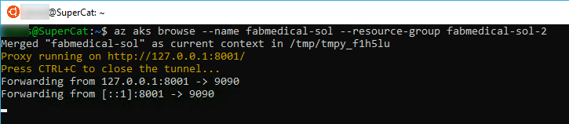
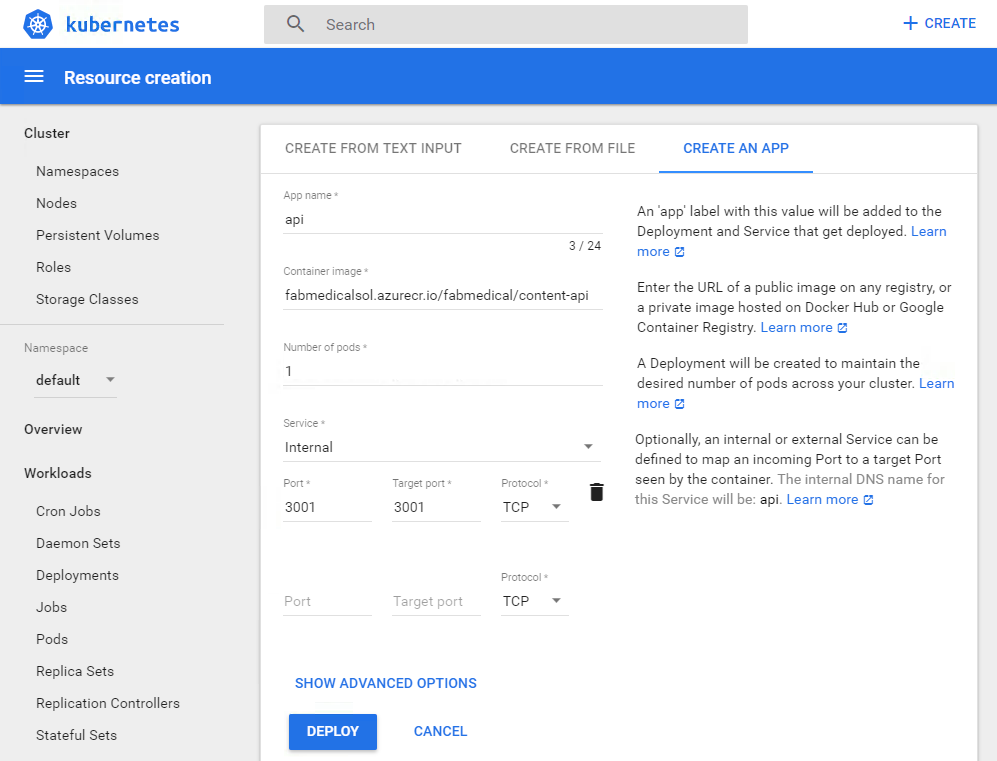
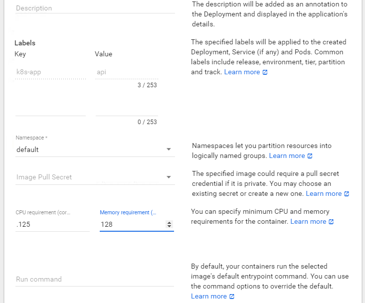
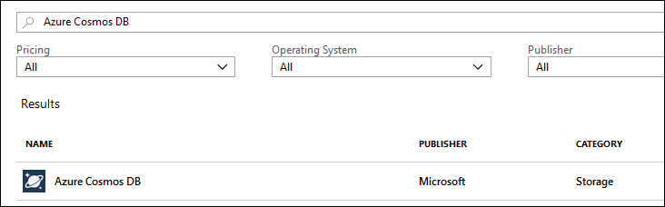
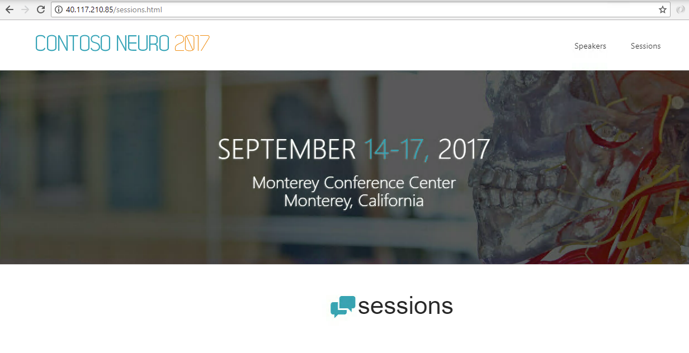
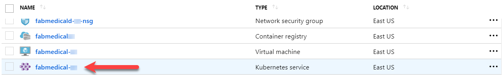

<div class="MCWHeader1">
Containers and DevOps - Developer edition
</div>

<div class="MCWHeader2">
Hands-on lab step-by-step - Exercise 2
</div>

<div class="MCWHeader3">
April 2019
</div>

Information in this document, including URL and other Internet Web site references, is subject to change without notice. Unless otherwise noted, the example companies, organizations, products, domain names, e-mail addresses, logos, people, places, and events depicted herein are fictitious, and no association with any real company, organization, product, domain name, e-mail address, logo, person, place or event is intended or should be inferred. Complying with all applicable copyright laws is the responsibility of the user. Without limiting the rights under copyright, no part of this document may be reproduced, stored in or introduced into a retrieval system, or transmitted in any form or by any means (electronic, mechanical, photocopying, recording, or otherwise), or for any purpose, without the express written permission of Microsoft Corporation.

Microsoft may have patents, patent applications, trademarks, copyrights, or other intellectual property rights covering subject matter in this document. Except as expressly provided in any written license agreement from Microsoft, the furnishing of this document does not give you any license to these patents, trademarks, copyrights, or other intellectual property.

The names of manufacturers, products, or URLs are provided for informational purposes only and Microsoft makes no representations and warranties, either expressed, implied, or statutory, regarding these manufacturers or the use of the products with any Microsoft technologies. The inclusion of a manufacturer or product does not imply endorsement of Microsoft of the manufacturer or product. Links may be provided to third party sites. Such sites are not under the control of Microsoft and Microsoft is not responsible for the contents of any linked site or any link contained in a linked site, or any changes or updates to such sites. Microsoft is not responsible for webcasting or any other form of transmission received from any linked site. Microsoft is providing these links to you only as a convenience, and the inclusion of any link does not imply endorsement of Microsoft of the site or the products contained therein.

© 2019 Microsoft Corporation. All rights reserved.

Microsoft and the trademarks listed at https://www.microsoft.com/en-us/legal/intellectualproperty/Trademarks/Usage/General.aspx are trademarks of the Microsoft group of companies. All other trademarks are property of their respective owners.

**Contents**

<!-- TOC -->

- [Containers and DevOps - Developer edition hands-on lab step-by-step]
  - [Exercise 2: Deploy the solution to Azure Kubernetes Service](#exercise-2-deploy-the-solution-to-azure-kubernetes-service)
    - [Task 1: Tunnel into the Azure Kubernetes Service cluster](#task-1-tunnel-into-the-azure-kubernetes-service-cluster)
    - [Task 2: Deploy a service using the Kubernetes management dashboard](#task-2-deploy-a-service-using-the-kubernetes-management-dashboard)
    - [Task 3: Deploy a service using kubectl](#task-3-deploy-a-service-using-kubectl)
    - [Task 4: Deploy a service using a Helm chart](#task-4-deploy-a-service-using-a-helm-chart)
    - [Task 5: Initialize database with a Kubernetes Job](#task-5-initialize-database-with-a-kubernetes-job)
    - [Task 6: Test the application in a browser](#task-6-test-the-application-in-a-browser)
    - [Task 7: Configure Continuous Delivery to the Kubernetes Cluster](#task-7-configure-continuous-delivery-to-the-kubernetes-cluster)
    - [Task 8: Review Azure Monitor for Containers](#task-8-review-azure-monitor-for-containers)
  

<!-- /TOC -->

# Containers and DevOps - Developer edition hands-on lab step-by-step


## Exercise 2: Deploy the solution to Azure Kubernetes Service

**Duration**: 30 minutes

In this exercise, you will connect to the Azure Kubernetes Service cluster you created before the hands-on lab and deploy the Docker application to the cluster using Kubernetes.

### Task 1: Tunnel into the Azure Kubernetes Service cluster

In this task, you will gather the information you need about your Azure Kubernetes Service cluster to connect to the cluster and execute commands to connect to the Kubernetes management dashboard from your local machine.

1. Open your WSL console (close the connection to the build agent if you are connected). From this WSL console, ensure that you installed the Azure CLI correctly by running the following command:

    ```bash
    az --version
    ```

    -  This should produce output similar to this:

    

    - If the output is not correct, review your steps from the instructions in Task 11: Install Azure CLI from the instructions before the lab exercises.

2. Also, check the installation of the Kubernetes CLI (kubectl) by running the following command:

    ```bash
    kubectl version
    ```

    - This should produce output similar to this:

    

    - If the output is not correct, review the steps from the instructions in Task 12: Install Kubernetes CLI from the instructions before the lab exercises.

3. Once you have installed and verified Azure CLI and Kubernetes CLI, login with the following command, and follow the instructions to complete your login as presented:

    ```bash
    az login
    ```

4. Verify that you are connected to the correct subscription with the following command to show your default subscription:

    ```bash
    az account show
    ```

    a. If you are not connected to the correct subscription, list your subscriptions and then set the subscription by its id with the following commands (similar to what you did in cloud shell before the lab):

    ```bash
    az account list
    az account set --subscription {id}
    ```

5. Configure kubectl to connect to the Kubernetes cluster:

    ```bash
    az aks get-credentials --name fabmedical-SUFFIX --resource-group fabmedical-SUFFIX
    ```

6. Test that the configuration is correct by running a simple kubectl command to produce a list of nodes:

    ```bash
    kubectl get nodes
    ```

    

7. Since the AKS cluster uses RBAC, a ClusterRoleBinding must be created before you can correctly access the dashboard. To create the required binding, execute the command bellow:

    ```bash
    kubectl create clusterrolebinding kubernetes-dashboard --clusterrole=cluster-admin --serviceaccount=kube-system:kubernetes-dashboard
    ```

8. Create an SSH tunnel linking a local port (8001) on your machine to port 80 on the management node of the cluster. Execute the command below replacing the values as follows:

   > **Note**: After you run this command, it may work at first and later lose its connection, so you may have to run this again to reestablish the connection. If the Kubernetes dashboard becomes unresponsive in the browser this is an indication to return here and check your tunnel or rerun the command.

    ```bash
    az aks browse --name fabmedical-SUFFIX --resource-group fabmedical-SUFFIX
    ```

    

9. Open a browser window and access the Kubernetes management dashboard at the Services view. To reach the dashboard, you must access the following address:

    ```bash
    http://localhost:8001
    ```

10. If the tunnel is successful, you will see the Kubernetes management dashboard.

    

### Task 2: Deploy a service using the Kubernetes management dashboard

In this task, you will deploy the API application to the Azure Kubernetes Service cluster using the Kubernetes dashboard.

1. From the Kubernetes dashboard, select Create in the top right corner.

2. From the Resource creation view, select Create an App.

    

    - Enter "api" for the App name.

    - Enter [LOGINSERVER]/content-api for the Container Image, replacing [LOGINSERVER] with your ACR login server, such as fabmedicalsol.azurecr.io.

    - Set Number of pods to 1.

    - Set Service to "Internal".

    - Use 3001 for Port and 3001 for Target port.

3. Select SHOW ADVANCED OPTIONS-----

    - Enter 0.125 for the CPU requirement.

    - Enter 128 for the Memory requirement.

    

4. Select Deploy to initiate the service deployment based on the image. This can take a few minutes. In the meantime, you will be redirected to the Overview dashboard. Select the API deployment from the Overview dashboard to see the deployment in progress.

    

5. Kubernetes indicates a problem with the api Replica Set.  Select the log icon to investigate.

    

6. The log indicates that the content-api application is once again failing because it cannot find a mongodb instance to communicate with.  You will resolve this issue by migrating your data workload to CosmosDb.

    

7. Open the Azure portal in your browser and click "+ Create a resource".  Search for "Azure Cosmos DB", select the result and click "Create".

    

8. Configure Azure Cosmos DB as follows and click "Review + create" and then click "Create":

    - **Subscription**: Use the same subscription you have used for all your other work.

    - **Resource Group**: fabmedical-SUFFIX

    - **Account Name**: fabmedical-SUFFIX

    - **API**: Azure Cosmos DB for MongoDB API

    - **Location**: Choose the same region that you did before.

    - **Geo-redundancy**: Enabled (checked)

    

9. Navigate to your resource group and find your new CosmosDb resource.  Click on the CosmosDb resource to view details.

    

10. Under "Quick Start" select the "Node.js" tab and copy the Node 3.0 connection string.

    

11. Update the provided connection string with a database "contentdb" and a replica set "globaldb".

    >**Note**: User name and password redacted for brevity.

    ```text
    mongodb://<USERNAME>:<PASSWORD>@fabmedical-sol2.documents.azure.com:10255/contentdb?ssl=true&replicaSet=globaldb
    ```

12. You will setup a Kubernetes secret to store the connection string, and configure the content-api application to access the secret.  First, you must base64 encode the secret value.  Open your WSL window and use the following command to encode the connection string and then, copy the output.

    ```bash
    echo -n "<connection string value>" | base64 -w 0
    ```

13. Return to the Kubernetes UI in your browser and click "+ Create".  Update the following YAML with the encoded connection string from your clipboard, paste the YAML data into the create dialog and click "Upload".

    ```yaml
    apiVersion: v1
    kind: Secret
    metadata:
        name: mongodb
    type: Opaque
    data:
        db: <base64 encoded value>
    ```

    

14. Scroll down in the Kubernetes dashboard until you can see "Secrets" in the left-hand menu.  Click it.

    

15. View the details for the "mongodb" secret.  Click the eyeball icon to show the secret.

    

16. Next, download the api deployment configuration using the following command in your WSL window:

    ```bash
    kubectl get -o=yaml --export=true deployment api > api.deployment.yml
    ```

17. Edit the downloaded file:

    ```bash
    vi api.deployment.yml
    ```

       - Add the following environment configuration to the container spec, below the "image" property:

    ```yaml
    - image: [LOGINSERVER].azurecr.io/fabmedical/content-api
      env:
        - name: MONGODB_CONNECTION
          valueFrom:
            secretKeyRef:
              name: mongodb
              key: db
    ```

    

18. Update the api deployment by using `kubectl` to apply the new configuration.

    ```bash
    kubectl apply -f api.deployment.yml
    ```

19. Select "Deployments" then "api" to view the api deployment. It now has a healthy instance and the logs indicate it has connected to mongodb.

    

### Task 3: Deploy a service using kubectl

In this task, deploy the web service using `kubectl`.

1. Open a **new** WSL console.

2. Create a text file called web.deployment.yml using Vim and press the "i" key to go into edit mode.

    ```bash
    vi web.deployment.yml
    <i>
    ```

3. Copy and paste the following text into the editor:

    >**Note**: Be sure to copy and paste only the contents of the code block carefully to avoid introducing any special characters. If the code does not paste correctly, you can issue a ":set paste" command before pasting.

    ```yaml
    apiVersion: extensions/v1beta1
    kind: Deployment
    metadata:
      labels:
          app: web
      name: web
    spec:
      replicas: 1
      selector:
          matchLabels:
            app: web
      strategy:
          rollingUpdate:
            maxSurge: 1
            maxUnavailable: 1
          type: RollingUpdate
      template:
          metadata:
            labels:
                app: web
            name: web
          spec:
            containers:
            - image: [LOGINSERVER].azurecr.io/content-web
              env:
                - name: CONTENT_API_URL
                  value: http://api:3001
              livenessProbe:
                httpGet:
                    path: /
                    port: 3000
                initialDelaySeconds: 30
                periodSeconds: 20
                timeoutSeconds: 10
                failureThreshold: 3
              imagePullPolicy: Always
              name: web
              ports:
                - containerPort: 3000
                  hostPort: 80
                  protocol: TCP
              resources:
                requests:
                    cpu: 1000m
                    memory: 128Mi
              securityContext:
                privileged: false
              terminationMessagePath: /dev/termination-log
              terminationMessagePolicy: File
            dnsPolicy: ClusterFirst
            restartPolicy: Always
            schedulerName: default-scheduler
            securityContext: {}
            terminationGracePeriodSeconds: 30
    ```

4. Edit this file and update the [LOGINSERVER] entry to match the name of your ACR login server.

5. Press the Escape key and type ":wq". Then press the Enter key to save and close the file.

    ```text
    <Esc>
    :wq
    <Enter>
    ```

6. Create a text file called web.service.yml using Vim, and press the "i" key to go into edit mode.

    ```bash
    vi web.service.yml
    ```

7. Copy and paste the following text into the editor:

    >**Note**: Be sure to copy and paste only the contents of the code block carefully to avoid introducing any special characters.

    ```yaml
    apiVersion: v1
    kind: Service
    metadata:
      labels:
          app: web
      name: web
    spec:
      ports:
        - name: web-traffic
          port: 80
          protocol: TCP
          targetPort: 3000
      selector:
          app: web
      sessionAffinity: None
      type: LoadBalancer
    ```

8. Press the Escape key and type ":wq"; then press the Enter key to save and close the file.

9. Type the following command to deploy the application described by the YAML files. You will receive a message indicating the items kubectl has created a web deployment and a web service.

    ```bash
    kubectl create --save-config=true -f web.deployment.yml -f web.service.yml
    ```

    

10. Return to the browser where you have the Kubernetes management dashboard open. From the navigation menu, select Services view under Discovery and Load Balancing. From the Services view, select the web service and from this view, you will see the web service deploying. This deployment can take a few minutes. When it completes you should be able to access the website via an external endpoint.

    

11. Select the speakers and sessions links. Note that no data is displayed, although we have connected to our CosmosDb instance, there is no data loaded. You will resolve this by running the content-init application as a Kubernetes Job in Task 5.

    

### Task 4: Deploy a service using a Helm chart

In this task, deploy the web service using a helm chart.

1. From the Kubernetes dashboard, under "Workloads", select "Deployments".

2. Click the triple vertical dots on the right of the "web" deployment and then select "Delete". When prompted, click "Delete" again.

    

3. From the Kubernetes dashboard, under "Discovery and Load Balancing", select "Services".

4. Click the triple vertical dots on the right of the "web" service and then select "Delete". When prompted, click "Delete" again.

    

5. Open a **new** WSL console.

6. Create a text file called rbac-config.yaml using Vim and press the "i" key to go into edit mode.

    ```bash
    vi rbac-config.yaml
    <i>
    ```

7. Copy and paste the following text into the editor:

    >**Note**: Be sure to copy and paste only the contents of the code block carefully to avoid introducing any special characters. If the code does not paste correctly, you can issue a ":set paste" command before pasting.

    ```yaml
    apiVersion: v1
    kind: ServiceAccount
    metadata:
      name: tiller
      namespace: kube-system
    ---
    apiVersion: rbac.authorization.k8s.io/v1
    kind: ClusterRoleBinding
    metadata:
      name: tiller
    roleRef:
      apiGroup: rbac.authorization.k8s.io
      kind: ClusterRole
      name: cluster-admin
    subjects:
      - kind: ServiceAccount
        name: tiller
        namespace: kube-system
    ```

8. Press the Escape key and type ":wq". Then press the Enter key to save and close the file.

    ```text
    <Esc>
    :wq
    <Enter>
    ```

9. Type the following command to create the service account needed by Tiller (the Helm server part).

    ```bash
    kubectl create -f rbac-config.yaml
    ```

10. Type the following command to initialize Helm using the previously service account setup.

    ```bash
    helm init --service-account tiller
    ```

11. We will use the `helm create` command to scaffold out a chart implementation that we can build on. Use the following commands to create a new chart named `web` in a new directory:

    ```bash
    cd FabMedical/content-web
    mkdir charts
    cd charts
    helm create web
    ```

12. We now need to update the generated scaffold to match our requirements. We will first update the file named `values.yaml`.

    ```bash
    cd web
    vi values.yaml
    <i>
    ```

13. Search for the `image` definition and update the values so that they match the following:

    ```yaml
    image:
      repository: [LOGINSERVER].azurecr.io/content-web
      tag: latest
      pullPolicy: Always
    ```

14. Search for `nameOverride` and `fullnameOverride` entries and update the values so that they match the following:

    ```yaml
    nameOverride: "web"
    fullnameOverride: "web"
    ```

15. Search for the `service` definition and update the values so that they match the following:

    ```yaml
    service:
      type: LoadBalancer
      port: 80
    ```

16. Search for the `resources` definition and update the values so that they match the following:

    ```yaml
    resources:
      # We usually recommend not to specify default resources and to leave this as a conscious
      # choice for the user. This also increases chances charts run on environments with little
      # resources, such as Minikube. If you do want to specify resources, uncomment the following
      # lines, adjust them as necessary, and remove the curly braces after 'resources:'.
      # limits:
      #  cpu: 100m
      #  memory: 128Mi
      requests:
        cpu: 1000m
        memory: 128Mi
    ```

17. Press the Escape key and type ":wq". Then press the Enter key to save and close the file.

    ```text
    <Esc>
    :wq
    <Enter>
    ```

18. We will now update the file named `deployment.yaml`.

    ```bash
    cd templates
    vi deployment.yaml
    <i>
    ```

19. Search for the `containers` definition and update the values so that they match the following:

    ```yaml
    containers:
      - name: {{ .Chart.Name }}
        image: "{{ .Values.image.repository }}:{{ .Values.image.tag }}"
        imagePullPolicy: {{ .Values.image.pullPolicy }}
        ports:
          - name: http
            containerPort: 3000
            protocol: TCP
        env:
        - name: CONTENT_API_URL
          value: http://api:3001
        livenessProbe:
          httpGet:
            path: /
            port: 3000
    ```

20. Press the Escape key and type ":wq". Then press the Enter key to save and close the file.

    ```text
    <Esc>
    :wq
    <Enter>
    ```

21. We will now update the file named `service.yaml`.

    ```bash
    vi service.yaml
    <i>
    ```

22. Search for the `ports` definition and update the values so that they match the following:

    ```yaml
    ports:
      - port: {{ .Values.service.port }}
        targetPort: 3000
        protocol: TCP
        name: http
    ```

23. Press the Escape key and type ":wq". Then press the Enter key to save and close the file.

    ```text
    <Esc>
    :wq
    <Enter>
    ```

24. The chart is now setup to run our web container. Type the following command to deploy the application described by the YAML files. You will receive a message indicating that helm has created a web deployment and a web service.

    ```bash
    cd ../..
    helm install --name web ./web
    ```

    

25. Return to the browser where you have the Kubernetes management dashboard open. From the navigation menu, select Services view under Discovery and Load Balancing. From the Services view, select the web service and from this view, you will see the web service deploying. This deployment can take a few minutes. When it completes you should be able to access the website via an external endpoint.

    

26. Select the speakers and sessions links. Note that no data is displayed, although we have connected to our CosmosDb instance, there is no data loaded. You will resolve this by running the content-init application as a Kubernetes Job.

    

27. We will now persist the changes into the repository. Execute the following commands:

    ```bash
    cd ..
    git pull
    git add charts/
    git commit -m "Helm chart added."
    git push
    ```

### Task 5: Initialize database with a Kubernetes Job

In this task, you will use a Kubernetes Job to run a container that is meant to execute a task and terminate, rather than run all the time.

1. In your WSL window create a text file called init.job.yml using Vim, and press the "i" key to go into edit mode.

    ```bash
    vi init.job.yml
    ```

2. Copy and paste the following text into the editor:

   > **Note**: Be sure to copy and paste only the contents of the code block carefully to avoid introducing any special characters.

    ```yaml
    apiVersion: batch/v1
    kind: Job
    metadata:
      name: init
    spec:
      template:
        spec:
          containers:
          - name: init
            image: [LOGINSERVER]/content-init
            env:
              - name: MONGODB_CONNECTION
                valueFrom:
                  secretKeyRef:
                    name: mongodb
                    key: db
          restartPolicy: Never
      backoffLimit: 4
    ```

3. Edit this file and update the [LOGINSERVER] entry to match the name of your ACR login server.

4. Press the Escape key and type ":wq". Then press the Enter key to save and close the file.

5. Type the following command to deploy the job described by the YAML. You will receive a message indicating the kubectl has created an init "job.batch".

    ```bash
    kubectl create --save-config=true -f init.job.yml
    ```

6. View the Job by selecting "Jobs" under "Workloads" in the Kubernetes UI.

    

7. Select the log icon to view the logs.

    

8. Next view your CosmosDb instance in the Azure portal and see that it now contains two collections.

    

### Task 6: Test the application in a browser

In this task, you will verify that you can browse to the web service you have deployed and view the speaker and content information exposed by the API service.

1. From the Kubernetes management dashboard, in the navigation menu, select the Services view under Discovery and Load Balancing.

2. In the list of services, locate the external endpoint for the web service and select this hyperlink to launch the application.

    

3. You will see the web application in your browser and be able to select the Speakers and Sessions links to view those pages without errors. The lack of errors means that the web application is correctly calling the API service to show the details on each of those pages.

    

    

### Task 7: Configure Continuous Delivery to the Kubernetes Cluster

In this task, you will update a Build Pipeline and configure a Release Pipeline in your Azure DevOps account so that when new images are pushed to the ACR, they get deployed to the AKS cluster.

1. We will use Azure DevOps to automate the process for deploying the web image to the AKS cluster. Login to your Azure DevOps account, access the project you created earlier, then select "Pipelines", and then select "Builds".

2. From the builds list, select the `content-web-Container-CI` build and then click `Edit.`

    

3. In the `Agent job 1` row, click `+`.

    

4. Search for "Helm", select "Helm tool installer" and then click "Add".

    

5. Still using the same search, select "Package and deploy Helm charts" and then click "Add".

    

6. Search for "Publish Artifacts", select "Publish Build Artifacts" and then click "Add".

    

7. Select "helm ls":

    - **Azure subscription**: Choose "azurecloud-sol".

    - **Resource group**: Choose your resource group by name.

    - **Kubernetes cluster**: Choose your AKS instance by name.

    - **Command**: Select "package".

    - **Chart Path**: Select "charts/web".

    

8. Select "Publish Artifact: drop":

    - **Path to publish**: Ensure that the value matches "$(Build.ArtifactStagingDirectory)".

    - **Artifact name**: Update the value to "chart".

    

9. Select "Save & queue"; then select "Save & queue" two more times to kick off the build.

10. Now create your first release. Select "Pipelines, then select "Releases", and then select "New pipeline".

    

11. Search for "Helm" templates and choose "Deploy an application to a Kubernetes cluster by using its Helm chart." then select "Apply".

    

12. Change the release name to "content-web-AKS-CD".

    

13. Select "+ Add an artifact".

    

14. Setup the artifact:

    - **Project**: fabmedical

    - **Source (build pipeline)**: content-web-Container-CI

    - **Default version**: select "Latest"

    

15. Select the "Continuous deployment trigger".

    

16. Enable the continuous deployment.

    

17. In "Stage 1", click "1 job, 3 tasks".

    

18. Setup the stage:

    - **Azure subscription**: Choose "azurecloud-sol".

    - **Resource group**: Choose your resource group by name.

    - **Kubernetes cluster**: Choose your AKS instance by name.

    

19. Select "helm init":

    - **Command**: select "init"

    - **Arguments**: Update the value to "--service-account tiller"

    

20. Select "helm upgrade":

    - **Command**: select "upgrade"
    - **Chart Type**: select "File Path"
    - **Chart Path**: select the location of the chart artifact
    - **Release Name**: web
    - **Set values**: image.tag=$(Build.BuildId)

    

21. Select "Save" and then "OK".

22. Select "+ Release", then "+ Create a release" and then "Create" to kick off the release.

### Task 8: Review Azure Monitor for Containers

In this task, you will access and review the various logs and dashboards made available by Azure Monitor for Containers.

1. From the Azure Portal, select the resource group you created named fabmedical-SUFFIX, and then select your AKS cluster.

    

2. From the Monitoring blade, select **Insights**.

    

3. Review the various available dashboards and a deeper look at the various metrics and logs available on the Cluster, Cluster Nodes, Cluster Controllers and deployed Containers.

    

4. To review the Containers dashboards and see more detailed information about each container click on containers tab.

    

5. Now filter by container name and search for the web containers, you will see all the containers created in the Kubernetes cluster with the pod names, you can compare the names with those in the kubernetes dashboard.  

    

6. By default, the CPU Usage metric will be selected displaying all cpu information for the selected container, to switch to another metric open the metric dropdown list and select a different metric.

    

7. Upon selecting any pod, all the information related to the selected metric will be displayed on the right panel, and that would be the case when selecting any other metric, the details will be displayed on the right panel for the selected pod.

    

8. To display the logs for any container simply select it and view the right panel and you will find "View Container Log" link which will list all logs for this specific container.

    

9. For each log entry you can display more information by expanding the log entry to view the below details.

    
    
