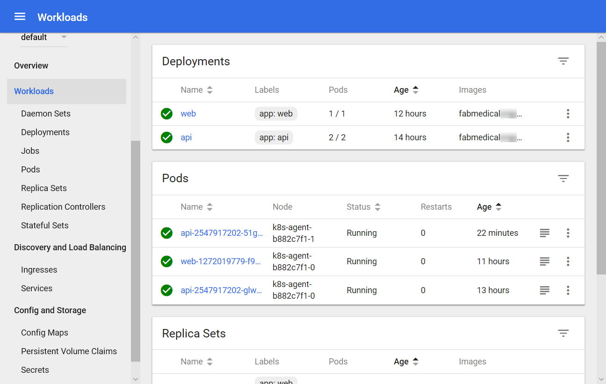
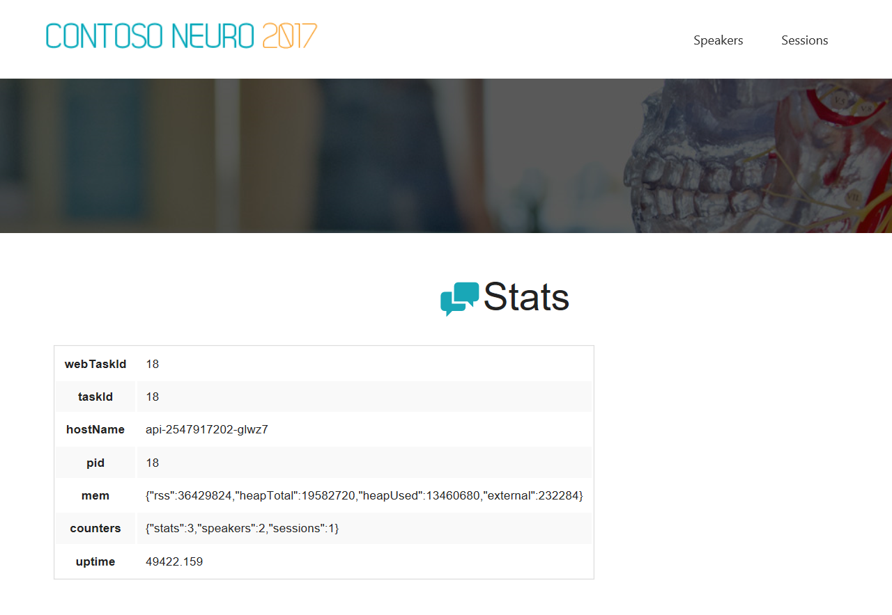
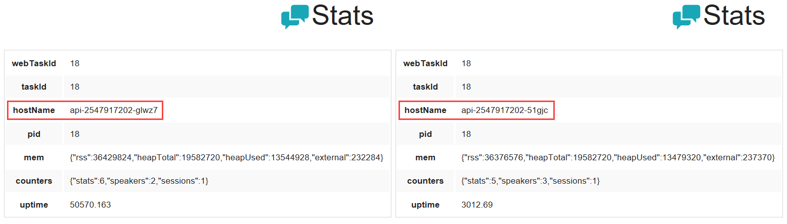
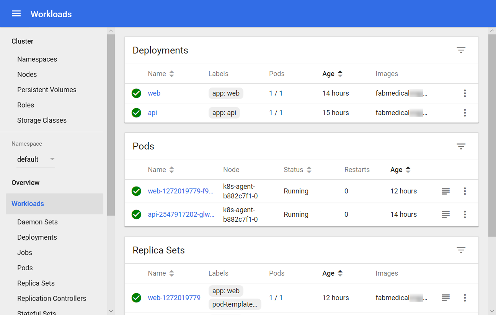

<div class="MCWHeader1">
Containers and DevOps - Developer edition
</div>

<div class="MCWHeader2">
Hands-on lab step-by-step - Exercise 3
</div>

<div class="MCWHeader3">
April 2019
</div>

Information in this document, including URL and other Internet Web site references, is subject to change without notice. Unless otherwise noted, the example companies, organizations, products, domain names, e-mail addresses, logos, people, places, and events depicted herein are fictitious, and no association with any real company, organization, product, domain name, e-mail address, logo, person, place or event is intended or should be inferred. Complying with all applicable copyright laws is the responsibility of the user. Without limiting the rights under copyright, no part of this document may be reproduced, stored in or introduced into a retrieval system, or transmitted in any form or by any means (electronic, mechanical, photocopying, recording, or otherwise), or for any purpose, without the express written permission of Microsoft Corporation.

Microsoft may have patents, patent applications, trademarks, copyrights, or other intellectual property rights covering subject matter in this document. Except as expressly provided in any written license agreement from Microsoft, the furnishing of this document does not give you any license to these patents, trademarks, copyrights, or other intellectual property.

The names of manufacturers, products, or URLs are provided for informational purposes only and Microsoft makes no representations and warranties, either expressed, implied, or statutory, regarding these manufacturers or the use of the products with any Microsoft technologies. The inclusion of a manufacturer or product does not imply endorsement of Microsoft of the manufacturer or product. Links may be provided to third party sites. Such sites are not under the control of Microsoft and Microsoft is not responsible for the contents of any linked site or any link contained in a linked site, or any changes or updates to such sites. Microsoft is not responsible for webcasting or any other form of transmission received from any linked site. Microsoft is providing these links to you only as a convenience, and the inclusion of any link does not imply endorsement of Microsoft of the site or the products contained therein.

© 2019 Microsoft Corporation. All rights reserved.

Microsoft and the trademarks listed at https://www.microsoft.com/en-us/legal/intellectualproperty/Trademarks/Usage/General.aspx are trademarks of the Microsoft group of companies. All other trademarks are property of their respective owners.

**Contents**

<!-- TOC -->

- [Containers and DevOps - Developer edition hands-on lab step-by-step](#containers-and-devops-developer-edition-hands-on-lab-step-by-step)  
  - [Exercise 3: Scale the application and test HA](#exercise-3-scale-the-application-and-test-ha)
    - [Task 1: Increase service instances from the Kubernetes dashboard](#task-1-increase-service-instances-from-the-kubernetes-dashboard)
    - [Task 2: Increase service instances beyond available resources](#task-2-increase-service-instances-beyond-available-resources)
    - [Task 3: Restart containers and test HA](#task-3-restart-containers-and-test-ha)

<!-- /TOC -->

# Containers and DevOps - Developer edition hands-on lab step-by-step

    
## Exercise 3: Scale the application and test HA

**Duration**: 20 minutes

At this point you have deployed a single instance of the web and API service containers. In this exercise, you will increase the number of container instances for the web service and scale the front end on the existing cluster.

### Task 1: Increase service instances from the Kubernetes dashboard

In this task, you will increase the number of instances for the API deployment in the Kubernetes management dashboard. While it is deploying, you will observe the changing status.

1. From the navigation menu, select Workloads\>Deployments, and then select the API deployment.

2. Select SCALE.

    

3. Change the number of pods to 2, and then select **OK**.

    

    >**Note: If the deployment completes quickly, you may not see the deployment Waiting states in the dashboard as described in the following steps**.

4. From the Replica Set view for the API, you'll see it is now deploying and that there is one healthy instance and one pending instance.

    

5. From the navigation menu, select Deployments from the list. Note that the api service has a pending status indicated by the grey timer icon and it shows a pod count 1 of 2 instances (shown as "1/2").

    

6. From the Navigation menu, select Workloads. From this view, note that the health overview in the right panel of this view. You'll see the following:

    - One deployment and one replica set are each healthy for the api service.

    - One replica set is healthy for the web service.

    - Three pods are healthy.

7. Navigate to the web application from the browser again. The application should still work without errors as you navigate to Speakers and Sessions pages

    - Navigate to the /stats.html page. You'll see information about the environment including:

        - **webTaskId:** The task identifier for the web service instance.

        - **taskId:** The task identifier for the API service instance.

        - **hostName:** The hostname identifier for the API service instance.

        - **pid:** The process id for the API service instance.

        - **mem:** Some memory indicators returned from the API service instance.

        - **counters:** Counters for the service itself, as returned by the API service instance.

        - **uptime:** The up time for the API service.

    - Refresh the page in the browser, and you can see the hostName change between the two API service instances. The letters after "api-{number}-" in the hostname will change.

### Task 2: Increase service instances beyond available resources

In this task, you will try to increase the number of instances for the API service container beyond available resources in the cluster. You will observe how Kubernetes handles this condition and correct the problem.

1. From the navigation menu, select Deployments. From this view, select the API deployment.

2. Configure the deployment to use a fixed host port for initial testing. Select Edit.

    

3. In the Edit a Deployment dialog, you will see a list of settings shown in JSON format. Use the copy button to copy the text to your clipboard.

    

4. Paste the contents into the text editor of your choice (notepad is shown here, MacOS users can use TextEdit).

    

5. Scroll down about half way to find the node "$.spec.template.spec.containers[0]", as shown in the screenshot below.

    ![Screenshot of the deployment JSON code, with the \$.spec.template.spec.containers\[0\] section highlighted.](media/image84.png)

6. The containers spec has a single entry for the API container at the moment. You'll see that the name of the container is "api" - this is how you know you are looking at the correct container spec.

    - Add the following JSON snippet below the "name" property in the container spec:

    ```json
    "ports": [
        {
        "containerPort": 3001,
        "hostPort": 3001
        }
    ],
    ```

    - Your container spec should now look like this:

    ![Screenshot of the deployment JSON code, with the \$.spec.template.spec.containers\[0\] section highlighted, showing the updated values for containerPort and hostPost, both set to port 3001.](media/image85.png)

7. Copy the updated JSON document from notepad into the clipboard. Return to the Kubernetes dashboard, which should still be viewing the "api" deployment.

    - Select Edit.

    

    - Paste the updated JSON document.

    - Select Update.

    

8. From the API deployment view, select **Scale**.

    

9. Change the number of pods to 4 and select **OK**.

    

10. From the navigation menu, select Services view under Discovery and Load Balancing. Select the api service from the Services list. From the api service view, you'll see it has two healthy instances and two unhealthy (or possibly pending depending on timing) instances.

    

11. After a few minutes, select Workloads from the navigation menu. From this view, you should see an alert reported for the api deployment.

    

    >**Note**: This message indicates that there weren't enough available resources to match the requirements for a new pod instance. In this case, this is because the instance requires port 3001, and since there are only 2 nodes available in the cluster, only two api instances can be scheduled. The third and fourth pod instances will wait for a new node to be available that can run another instance using that port.

12. Reduce the number of requested pods to 2 using the Scale button.

13. Almost immediately, the warning message from the Workloads dashboard should disappear, and the API deployment will show 2/2 pods are running.

    

### Task 3: Restart containers and test HA

In this task, you will restart containers and validate that the restart does not impact the running service.

1. From the navigation menu on the left, select Services view under Discovery and Load Balancing. From the Services list, select the external endpoint hyperlink for the web service, and visit the stats page by adding /stats.html to the URL. Keep this open and handy to be refreshed as you complete the steps that follow.

    

    

2. From the navigation menu, select Workloads>Deployments. From Deployments list, select the API deployment.

    

3. From the API deployment view, select **Scale** and from the dialog presented, and enter 4 for the desired number of pods. Select **OK**.

4. From the navigation menu, select Workloads>Replica Sets. Select the api replica set and, from the Replica Set view, you will see that two pods cannot deploy.

    

5. Return to the browser tab with the web application stats page loaded. Refresh the page over and over. You will not see any errors, but you will see the api host name change between the two api pod instances periodically. The task id and pid might also change between the two api pod instances.

    

6. After refreshing enough times to see that the hostName value is changing, and the service remains healthy, return to the Replica Sets view for the API. From the navigation menu, select Replica Sets under Workloads and select the API replica set.

7. From this view, take note that the hostName value shown in the web application stats page matches the pod names for the pods that are running.

    

8. Note the remaining pods are still pending, since there are not enough port resources available to launch another instance. Make some room by deleting a running instance. Select the context menu and choose Delete for one of the healthy pods.

    

9. Once the running instance is gone, Kubernetes will be able to launch one of the pending instances. However, because you set the desired size of the deploy to 4, Kubernetes will add a new pending instance. Removing a running instance allowed a pending instance to start, but in the end, the number of pending and running instances is unchanged.

    

10. From the navigation menu, select Deployments under Workloads. From the view's Deployments list select the API deployment.

11. From the API Deployment view, select Scale and enter 1 as the desired number of pods. Select OK.

    

12. Return to the web site's stats.html page in the browser and refresh while this is scaling down. You'll notice that only one API host name shows up, even though you may still see several running pods in the API replica set view. Even though several pods are running, Kubernetes will no longer send traffic to the pods it has selected to scale down. In a few moments, only one pod will show in the API replica set view.

    

13. From the navigation menu, select Workloads. From this view, note that there is only one API pod now.

    

