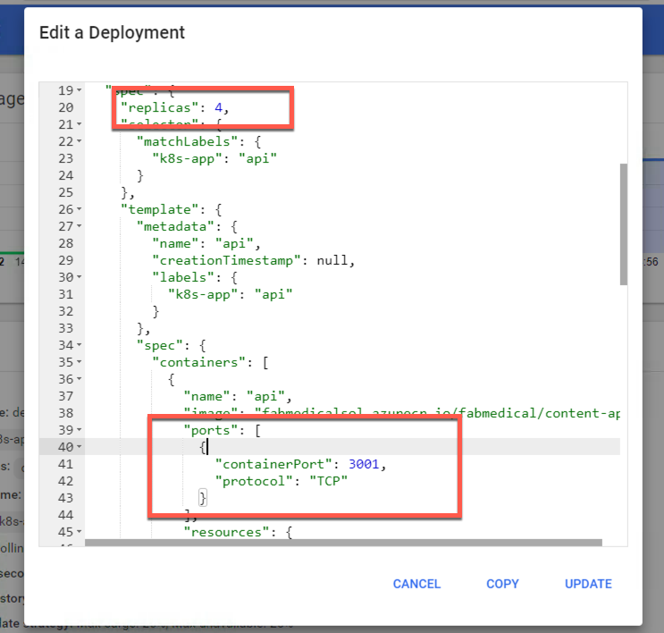
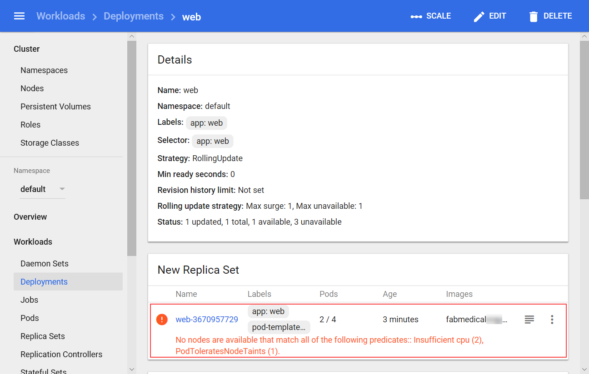
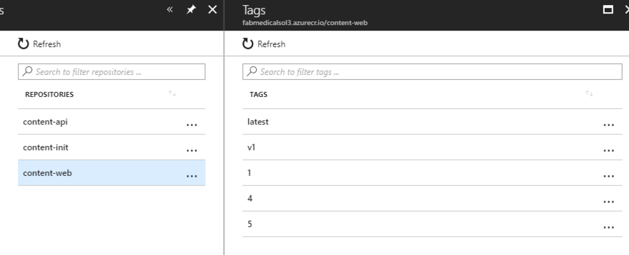
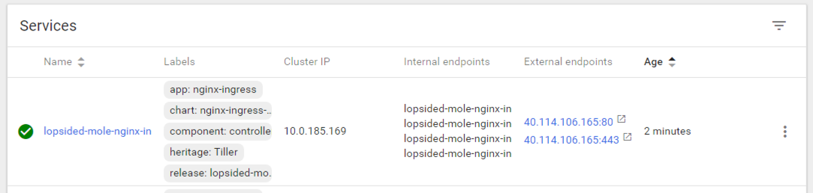
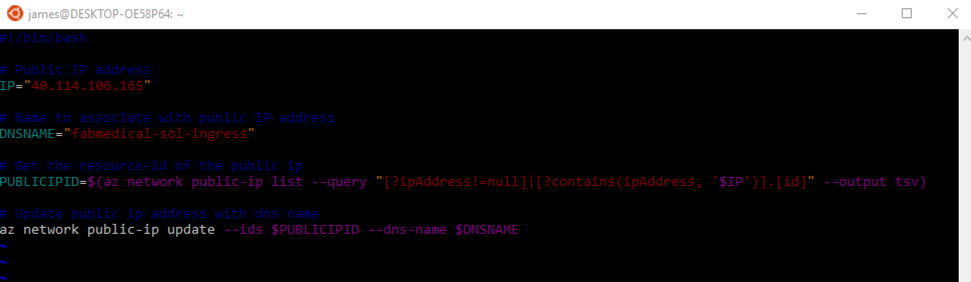

<div class="MCWHeader1">
Containers and DevOps - Developer edition
</div>

<div class="MCWHeader2">
Hands-on lab step-by-step - Exercise 4
</div>

<div class="MCWHeader3">
April 2019
</div>

Information in this document, including URL and other Internet Web site references, is subject to change without notice. Unless otherwise noted, the example companies, organizations, products, domain names, e-mail addresses, logos, people, places, and events depicted herein are fictitious, and no association with any real company, organization, product, domain name, e-mail address, logo, person, place or event is intended or should be inferred. Complying with all applicable copyright laws is the responsibility of the user. Without limiting the rights under copyright, no part of this document may be reproduced, stored in or introduced into a retrieval system, or transmitted in any form or by any means (electronic, mechanical, photocopying, recording, or otherwise), or for any purpose, without the express written permission of Microsoft Corporation.

Microsoft may have patents, patent applications, trademarks, copyrights, or other intellectual property rights covering subject matter in this document. Except as expressly provided in any written license agreement from Microsoft, the furnishing of this document does not give you any license to these patents, trademarks, copyrights, or other intellectual property.

The names of manufacturers, products, or URLs are provided for informational purposes only and Microsoft makes no representations and warranties, either expressed, implied, or statutory, regarding these manufacturers or the use of the products with any Microsoft technologies. The inclusion of a manufacturer or product does not imply endorsement of Microsoft of the manufacturer or product. Links may be provided to third party sites. Such sites are not under the control of Microsoft and Microsoft is not responsible for the contents of any linked site or any link contained in a linked site, or any changes or updates to such sites. Microsoft is not responsible for webcasting or any other form of transmission received from any linked site. Microsoft is providing these links to you only as a convenience, and the inclusion of any link does not imply endorsement of Microsoft of the site or the products contained therein.

© 2019 Microsoft Corporation. All rights reserved.

Microsoft and the trademarks listed at https://www.microsoft.com/en-us/legal/intellectualproperty/Trademarks/Usage/General.aspx are trademarks of the Microsoft group of companies. All other trademarks are property of their respective owners.

**Contents**

<!-- TOC -->

- [Containers and DevOps - Developer edition hands-on lab step-by-step](#containers-and-devops-developer-edition-hands-on-lab-step-by-step)
  - [Exercise 4: Setup load balancing and service discovery](#exercise-4-setup-load-balancing-and-service-discovery)
    - [Task 1: Scale a service without port constraints](#task-1-scale-a-service-without-port-constraints)
    - [Task 2: Update an external service to support dynamic discovery with a load balancer](#task-2-update-an-external-service-to-support-dynamic-discovery-with-a-load-balancer)
    - [Task 3: Adjust CPU constraints to improve scale](#task-3-adjust-cpu-constraints-to-improve-scale)
    - [Task 4: Perform a rolling update](#task-4-perform-a-rolling-update)
    - [Task 5: Configure Kubernetes Ingress](#task-5-configure-kubernetes-ingress)
  - [After the hands-on lab](#after-the-hands-on-lab)

<!-- /TOC -->

# Containers and DevOps - Developer edition hands-on lab step-by-step

## Exercise 4: Setup load balancing and service discovery

**Duration**: 45 minutes

In the previous exercise we introduced a restriction to the scale properties of the service. In this exercise, you will configure the api deployments to create pods that use dynamic port mappings to eliminate the port resource constraint during scale activities.

Kubernetes services can discover the ports assigned to each pod, allowing you to run multiple instances of the pod on the same agent node --- something that is not possible when you configure a specific static port (such as 3001 for the API service).

### Task 1: Scale a service without port constraints

In this task, we will reconfigure the API deployment so that it will produce pods that choose a dynamic hostPort for improved scalability.

1. From the navigation menu select Deployments under Workloads. From the view's Deployments list select the API deployment.

2. Select Edit.

3. From the Edit a Deployment dialog, do the following:

    - Scroll to the first spec node that describes replicas as shown in the screenshot. Set the value for replicas to 4.

    - Within the replicas spec, beneath the template node, find the "api" containers spec as shown in the screenshot. Remove the hostPort entry for the API container's port mapping.

        

4. Select **Update**. New pods will now choose a dynamic port.

5. The API service can now scale to 4 pods since it is no longer constrained to an instance per node -- a previous limitation while using port 3001.

    

6. Return to the browser and refresh the stats.html page. You should see all 4 pods serve responses as you refresh.

### Task 2: Update an external service to support dynamic discovery with a load balancer

In this task, you will update the web service so that it supports dynamic discovery through the Azure load balancer.

1. From the navigation menu, select Deployments under Workloads. From the view's Deployments list select the web deployment.

2. Select **Edit**.

3. From the Edit a Deployment dialog, scroll to the web containers spec as shown in the screenshot. Remove the hostPort entry for the web container's port mapping.

    

4. Select **Update**.

5. From the web Deployments view, select **Scale**. From the dialog presented enter 4 as the desired number of pods and select **OK**.

6. Check the status of the scale out by refreshing the web deployment's view. From the navigation menu, select Deployments from under Workloads. Select the web deployment. From this view, you should see an error like that shown in the following screenshot.

    

Like the API deployment, the web deployment used a fixed *hostPort*, and your ability to scale was limited by the number of available agent nodes. However, after resolving this issue for the web service by removing the *hostPort* setting, the web deployment is still unable to scale past two pods due to CPU constraints. The deployment is requesting more CPU than the web application needs, so you will fix this constraint in the next task.

### Task 3: Adjust CPU constraints to improve scale

In this task, you will modify the CPU requirements for the web service so that it can scale out to more instances.

1. From the navigation menu, select Deployments under Workloads. From the view's Deployments list select the web deployment.

2. Select **Edit**.

3. From the Edit a Deployment dialog, find the *cpu* resource requirements for the web container. Change this value to "125m".

    

4. Select **Update** to save the changes and update the deployment.

5. From the navigation menu, select Replica Sets under Workloads. From the view's Replica Sets list select the web replica set.

6. When the deployment update completes, four web pods should be shown in running state.

    

7. Return to the browser tab with the web application loaded. Refresh the stats page at /stats.html to watch the display update to reflect the different api pods by observing the host name refresh.

### Task 4: Perform a rolling update

In this task, you will edit the web application source code to add Application Insights and update the Docker image used by the deployment. Then you will perform a rolling update to demonstrate how to deploy a code change.

1. First create an Application Insights key for content-web using the Azure Portal.

2. Select "+ Create a Resource" and search for "Application Insights" and select "Application Insights".

    

3. Configure the resource as follows, then select "Create":

    - **Name**: content-web

    - **Application Type**: Node.js Application

    - **Subscription**: Use the same subscription you have been using throughout the lab.

    - **Resource Group**: Use the existing resource group fabmedical-SUFFIX.

    - **Location**: Use the same location you have been using throughout the lab.

    

4. While the Application Insights resource for content-web deploys, create a second Application Insights resource for content-api.  Configure the resource as follows, then select "Create":

   - **Name**: content-api

   - **Application Type**: Node.js Application

   - **Subscription**: Use the same subscription you have been using throughout the lab.

   - **Resource Group**: Use the existing resource group fabmedical-SUFFIX.

   - **Location**: Use the same location you have been using throughout the lab.

5. When both resources have deployed, locate them in your resource group.

    

6. Select the content-web resource to view the details.  Make a note of the Instrumentation Key; you will need it when configuring the content-web application.

    

7. Return to your resource group and view the details of the content-api Application Insights resource.  Make a note of its unique Instrumentation Key as well.

8. Connect to your build agent VM using ssh as you did in Task 6: Connect securely to the build agent before the hands-on lab.

9. From the command line, navigate to the content-web directory.

10. Install support for Application Insights.

    ```bash
    npm install applicationinsights --save
    ```

11. Open the server.js file using VI:

    ```bash
    vi server.js
    ```

12. Enter insert mode by pressing `<i>`.

13. Add the following lines immediately after the config is loaded.

    ```javascript
    const appInsights = require("applicationinsights");
    appInsights.setup(config.appInsightKey);
    appInsights.start();
    ```

    

14. Press the Escape key and type ":wq". Then press the Enter key to save and close the file.

    ```text
    <Esc>
    :wq
    <Enter>
    ```

15. Update your config files to include the Application Insights Key.

    ```bash
    vi config/env/production.js
    <i>
    ```

16. Add the following line to the `module.exports` object, and then update [YOUR APPINSIGHTS KEY] with the your Application Insights Key from the Azure portal.

    ```javascript
    appInsightKey: '[YOUR APPINSIGHTS KEY]'
    ```

    

17. Press the Escape key and type ":wq". Then press the Enter key to save and close the file.

18. Now update the development config:

    ```bash
    vi config/env/development.js
    <i>
    ```

19. Add the following line to the `module.exports` object, and then update [YOUR APPINSIGHTS KEY] with the your Application Insights Key from the Azure portal.

    ```javascript
    appInsightKey: '[YOUR APPINSIGHTS KEY]'
    ```

20. Press the Escape key and type ":wq". Then press the Enter key to save and close the file.

21. Push these changes to your repository so that Azure DevOps CI will build a new image while you work on updating the content-api application.

    ```bash
    git add .
    git commit -m "Added Application Insights"
    git push
    ```

22. Now update the content-api application.

    ```bash
    cd ../content-api
    npm install applicationinsights --save
    ```

23. Open the server.js file using VI:

    ```bash
    vi server.js
    ```

24. Enter insert mode by pressing `<i>`.

25. Add the following lines immediately after the config is loaded:

    ```javascript
    const appInsights = require("applicationinsights");
    appInsights.setup(config.appSettings.appInsightKey);
    appInsights.start();
    ```

    

26. Press the Escape key and type ":wq". Then press the Enter key to save and close the file.

    ```text
    <Esc>
    :wq
    <Enter>
    ```

27. Update your config files to include the Application Insights Key.

    ```bash
    vi config/config.js
    <i>
    ```

28. Add the following line to the `exports.appSettings` object, and then update [YOUR APPINSIGHTS KEY] with the your Application Insights Key for **content-api** from the Azure portal.

    ```javascript
    appInsightKey: '[YOUR APPINSIGHTS KEY]'
    ```

    

29. Press the Escape key and type ":wq". Then press the Enter key to save and close the file.

30. Push these changes to your repository so that Azure DevOps CI will build a new image.

    ```bash
    git add .
    git commit -m "Added Application Insights"
    git push
    ```

31. Visit your ACR to see the new images and make a note of the tags assigned by Azure DevOps.

     - Make a note of the latest tag for content-web.

        

     - And the latest tag for content-api.

        

32. Now that you have finished updating the source code, you can exit the build agent.

    ```bash
    exit
    ```

33. Visit your Azure DevOps Release pipeline for the content-web application and see the new image being deployed into your Kubernetes cluster.

34. From WSL, request a rolling update for the content-api application using this kubectl command:

    ```bash
    kubectl set image deployment/api api=[LOGINSERVER]/content-api:[LATEST TAG]
    ```

35. While this updates run, return the Kubernetes management dashboard in the browser.

36. From the navigation menu, select Replica Sets under Workloads. From this view you will see a new replica set for web which may still be in the process of deploying (as shown below) or already fully deployed.

    

37. While the deployment is in progress, you can navigate to the web application and visit the stats page at /stats.html. Refresh the page as the rolling update executes. Observe that the service is running normally, and tasks continue to be load balanced.

    

### Task 5: Configure Kubernetes Ingress

In this task you will setup a Kubernetes Ingress to take advantage of path-based routing and TLS termination.

1. Update your helm package list.

    ```bash
    helm repo update
    ```

2. Install the ingress controller resource to handle ingress requests as they come in.  The ingress controller will receive a public IP of its own on the Azure Load Balancer and be able to handle requests for multiple services over port 80 and 443.

    ```bash
    helm install stable/nginx-ingress --namespace kube-system --set controller.replicaCount=2
    ```

3. Set a DNS prefix on the IP address allocated to the ingress controller.  Visit the `kube-system` namespace in your Kubeneretes dashboard to find the IP.

    http://localhost:8001/#!/service?namespace=kube-system

    

4. Create a script to update the public DNS name for the IP.

    ```bash
    vi update-ip.sh
    <i>
    ```

    Paste the following as the contents and update the IP and SUFFIX values:

    ```bash
    #!/bin/bash

    # Public IP address
    IP="[INGRESS PUBLIC IP]"

    # Name to associate with public IP address
    DNSNAME="fabmedical-[SUFFIX]-ingress"

    # Get the resource-id of the public ip
    PUBLICIPID=$(az network public-ip list --query "[?ipAddress!=null]|[?contains(ipAddress, '$IP')].[id]" --output tsv)

    # Update public ip address with dns name
    az network public-ip update --ids $PUBLICIPID --dns-name $DNSNAME
    ```

    

5. Use `<esc>:wq` to save your script and exit VIM.

6. Run the update script.

    ```bash
    bash ./update-ip.sh
    ```

7. Verify the IP update by visiting the url in your browser.

    >**Note**: It is normal to receive a 404 message at this time.

    ```text
    http://fabmedical-[SUFFIX]-ingress.[AZURE-REGION].cloudapp.azure.com/
    ```

    

8. Use helm to install `cert-manager`; a tool that can provision SSL certificates automatically from letsencrypt.org.

    ```bash
    kubectl label namespace kube-system certmanager.k8s.io/disable-validation=true

    kubectl apply \
        -f https://raw.githubusercontent.com/jetstack/cert-manager/release-0.6/deploy/manifests/00-crds.yaml

    helm install stable/cert-manager \
        --namespace kube-system \
        --set ingressShim.defaultIssuerName=letsencrypt-prod \
        --set ingressShim.defaultIssuerKind=ClusterIssuer \
        --version v0.6.6
    ```

9. Cert manager will need a custom ClusterIssuer resource to handle requesting SSL certificates.

    ```bash
    vi clusterissuer.yml
    <i>
    ```

    The following resource configuration should work as is:

    ```yaml
    apiVersion: certmanager.k8s.io/v1alpha1
    kind: ClusterIssuer
    metadata:
      name: letsencrypt-prod
    spec:
      acme:
        # The ACME server URL
        server: https://acme-v02.api.letsencrypt.org/directory
        # Email address used for ACME registration
        email: user@fabmedical.com
        # Name of a secret used to store theACMEaccount private key
        privateKeySecretRef:
          name: letsencrypt-prod
        # Enable HTTP01 validations
        http01: {}
    ```

10. Save the file with `<esc>:wq`.

11. Create the issuer using kubectl.

    ```bash
    kubectl create --save-config=true -f clusterissuer.yml
    ```

12. Now you can create a certificate object.

    > **NOTE:**
    >
    > Cert-manager might have already created a certificate object for you using ingress-shim.
    >
    > To verify that the certificate was created successfully, use the `kubectl describe certificate tls-secret` command.
    >
    > If a certificate is already available, skip to step 15.

    ```bash
    vi certificate.yml
    <i>
    ```

    Use the following as the contents and update the [SUFFIX] and [AZURE-REGION] to match your ingress DNS name

    ```yaml
    apiVersion: certmanager.k8s.io/v1alpha1
    kind: Certificate
    metadata:
      name: tls-secret
    spec:
      secretName: tls-secret
      dnsNames:
      - fabmedical-[SUFFIX]-ingress.[AZURE-REGION].cloudapp.azure.com
      acme:
        config:
        - http01:
            ingressClass: nginx
          domains:
          - fabmedical-[SUFFIX]-ingress.[AZURE-REGION].cloudapp.azure.com
      issuerRef:
        name: letsencrypt-prod
        kind: ClusterIssuer
    ```

13. Save the file with `<esc>:wq`.

14. Create the certificate using kubectl.

    ```bash
    kubectl create --save-config=true -f certificate.yml
    ```

    > **Note**: To check the status of the certificate issuance, use the `kubectl describe certificate tls-secret` command and look for an *Events* output similar to the following:
    >
    > ```text
    > Type    Reason         Age   From          Message
    > ----    ------         ----  ----          -------
    > Normal  Generated      27s   cert-manager  Generated new private key
    > Normal  OrderCreated   27s   cert-manager  Created Order resource "tls-secret-1375302092"
    > Normal  OrderComplete  2s    cert-manager  Order "tls-secret-1375302092" completed successfully
    > Normal  CertIssued     2s    cert-manager  Certificate issued successfully
    > ```
    > .

15. Now you can create an ingress resource for the content applications.

    ```bash
    vi content.ingress.yml
    <i>
    ```

    Use the following as the contents and update the [SUFFIX] and [AZURE-REGION] to match your ingress DNS name

    ```yaml
    apiVersion: extensions/v1beta1
    kind: Ingress
    metadata:
      name: content-ingress
      annotations:
        kubernetes.io/ingress.class: nginx
        certmanager.k8s.io/cluster-issuer: letsencrypt-prod
        nginx.ingress.kubernetes.io/rewrite-target: /$1
    spec:
      tls:
      - hosts:
        - fabmedical-[SUFFIX]-ingress.[AZURE-REGION].cloudapp.azure.com
        secretName: tls-secret
      rules:
      - host:   fabmedical-[SUFFIX]-ingress.[AZURE-REGION].cloudapp.azure.com
        http:
          paths:
          - path: /
            backend:
              serviceName: web
              servicePort: 80
          - path: /content-api/(.*)
            backend:
              serviceName: api
              servicePort: 3001

    ```

16. Save the file with `<esc>:wq`.

17. Create the ingress using kubectl.

    ```bash
    kubectl create --save-config=true -f content.ingress.yml
    ```

18. Refresh the ingress endpoint in your browser.  You should be able to visit the speakers and sessions pages and see all the content.

19. Visit the api directly, by navigating to `/content-api/sessions` at the ingress endpoint.

    

20. Test TLS termination by visiting both services again using `https`.

    > It can take a few minutes before the SSL site becomes available.  This is due to the delay involved with provisioning a TLS cert from letsencrypt.

## After the hands-on lab

**Duration**: 10 mins

In this exercise, you will de-provision any Azure resources created in support of this lab.

1. Delete both of the Resource Groups in which you placed all of your Azure resources

    - From the Portal, navigate to the blade of your Resource Group and then select Delete in the command bar at the top.

    - Confirm the deletion by re-typing the resource group name and selecting Delete.

2. Delete the Service Principal created on Task 9: Create a Service Principal before the hands-on lab.

    ```bash
    az ad sp delete --id "Fabmedical-sp"
    ```

You should follow all steps provided *after* attending the Hands-on lab.
